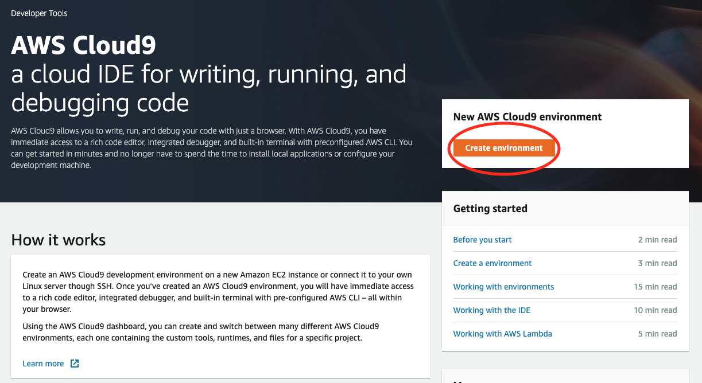
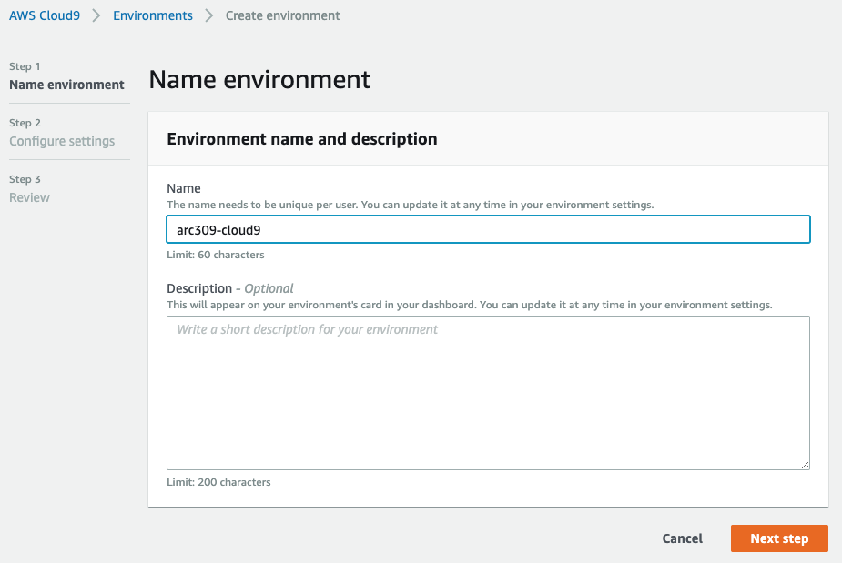
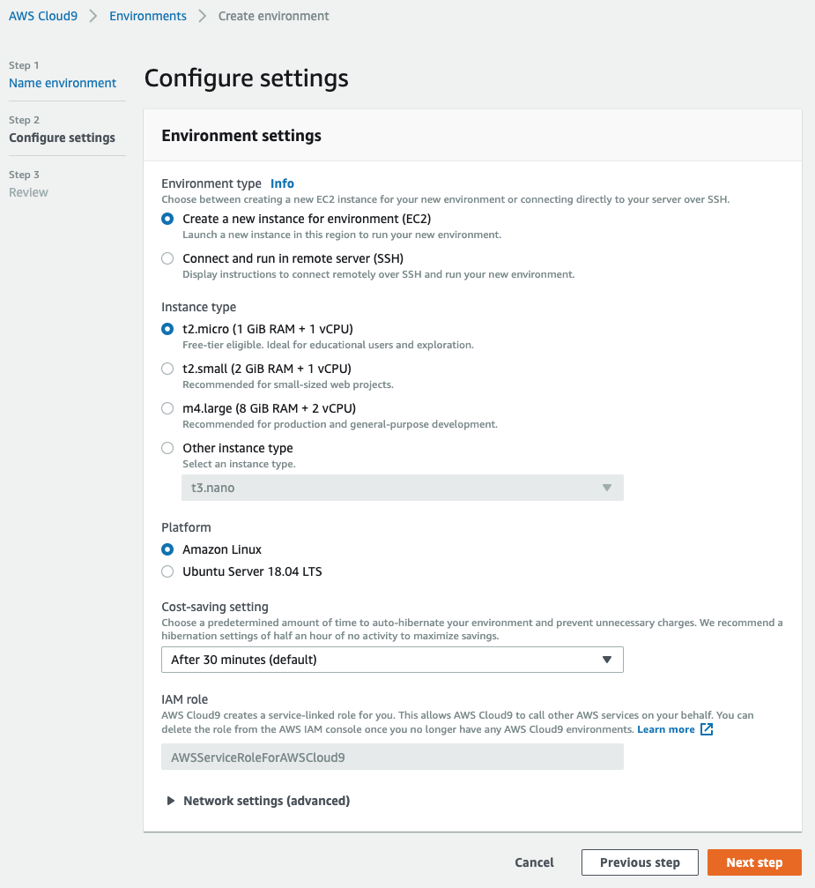
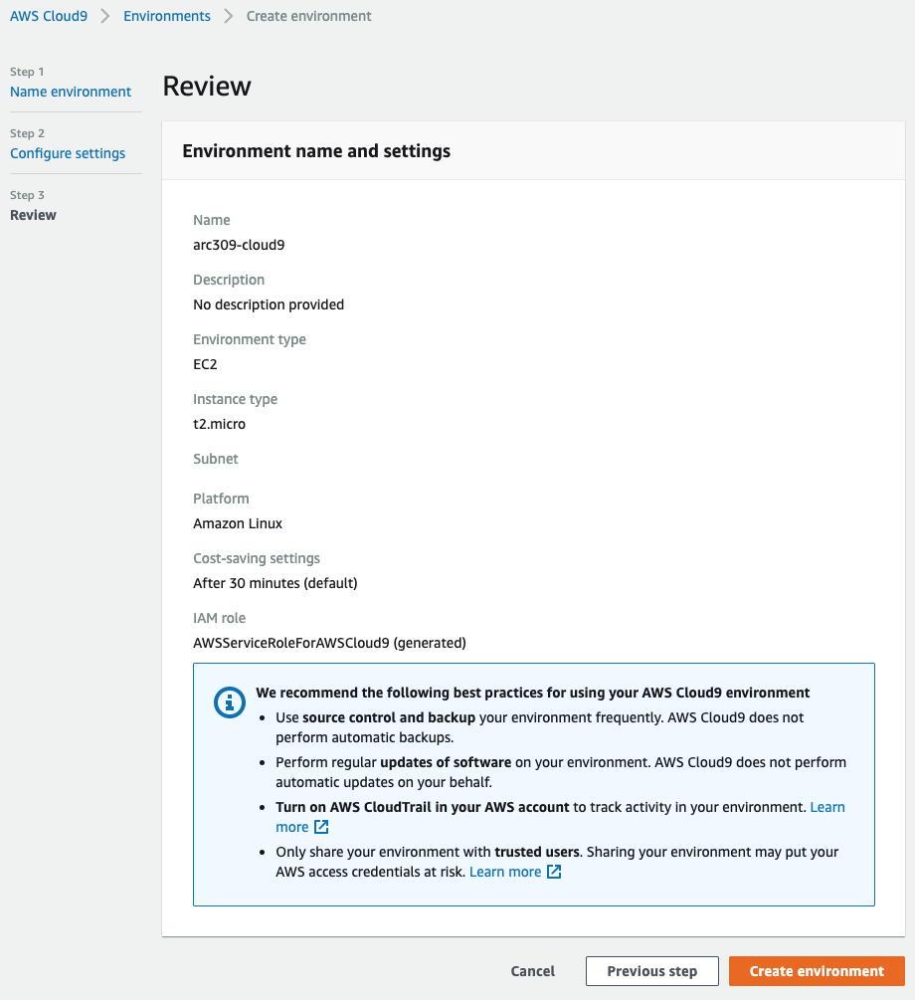
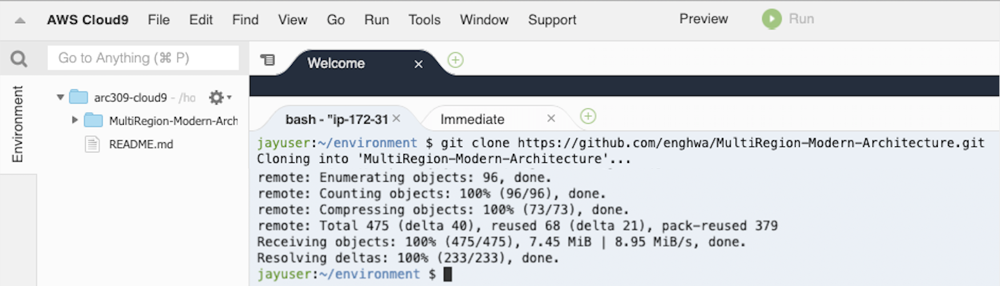

# AWS Cloud9 - Cloud IDE

Login to AWS Console, select *eu-west-1 Region* and spin up a AWS Cloud9 environment. Please use Firefox or Chrome to open AWS Cloud9. 

https://eu-west-1.console.aws.amazon.com/cloud9/home?region=eu-west-1 



Name your AWS Cloud9 Environment


AWS Cloud9 is free, you only pay for the underlying EC2 instance. Select your EC2 instance type. We can use t2.micro for this lab. To save cost, AWS Cloud9 will spin down the EC2 when you are not using it.



Click "Create environment" and AWS Cloud9 will start! It would typically take 30-60s to create your AWS Cloud9 environment.


## Install node and npm 



Once AWS Cloud9 is up and running, execute these 2 commands in the command shell of Cloud9. This is required for our AngularJS front end.

```bash
nvm install 8.9.1

nvm alias default v8.9.1

```

verify that you have the right `node` and `npm` :

```bash
enghwa:~/environment $ npm -v
5.5.1

enghwa:~/environment $ node -v
v8.9.1

enghwa:~/environment $ nvm ls
        v6.14.4  
->       v8.9.1  
         system  
default -> v8.9.1
node -> stable (-> v8.9.1) (default)
stable -> 8.9 (-> v8.9.1) (default)
iojs -> N/A (default)
lts/* -> lts/argon (-> N/A)
lts/argon -> v4.9.1 (-> N/A)
lts/boron -> v6.14.4
lts/carbon -> v8.12.0 (-> N/A)

```

## Clone the workshop project
```bash
git clone https://github.com/enghwa/MultiRegion-Serverless-Workshop.git

```

## Completion
[Go back](../README.md) or
Start the lab: [Build an API layer](../1_API/README.md)
