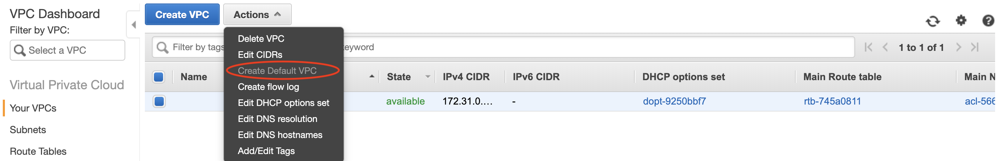
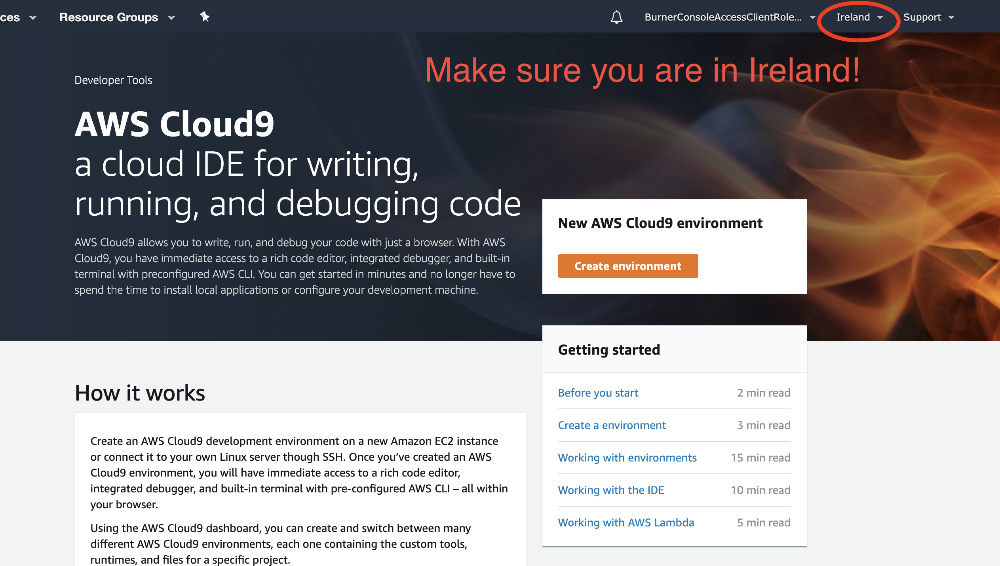

# AWS Cloud9 - Cloud IDE

Login to AWS Console, go to *Ireland(eu-west-1)* region and spin up a AWS Cloud9 environment. Please use Firefox or Chrome to open AWS Cloud9. If you don't have a VPC including **the default VPC**, you cannot deploy the Cloud9. Please create a default VPC first first before launching the Cloud9. 

<details><summary>Create a default VPC for Cloud9</summary>

Go to [VPC console in Ireland](https://eu-west-1.console.aws.amazon.com/vpc/home?region=eu-west-1#vpcs:sort=VpcId) and select `Your VPCs`. Click `Create Default VPC` in Actions.



</details>

If you have a VPC, go to [Cloud9](https://eu-west-1.console.aws.amazon.com/cloud9/home?region=eu-west-1 ) in Irelad.




Name your AWS Cloud9 Environment


AWS Cloud9 is free, you only pay for the underlying EC2 instance. Select your EC2 instance type. We can use t2.micro for this lab. To save cost, AWS Cloud9 will spin down the EC2 when you are not using it.


Click "Next Step", click "Create environment" and AWS Cloud9 will start! It would typically take 30-60s to create your AWS Cloud9 environment.


## Clone the workshop project
Once AWS Cloud9 is up and running, execute the following commands in the command shell of Cloud9 to clone the lab files to your Cloud9.

```bash
git clone https://github.com/enghwa/MultiRegion-Modern-Architecture.git

```


## Completion
Cloud9 setup is completed. [Go back to Main](../README.md) or let's start the 
the first module: [Build a BookStore in Primary Region](../1_PrimaryRegion/README.md)
