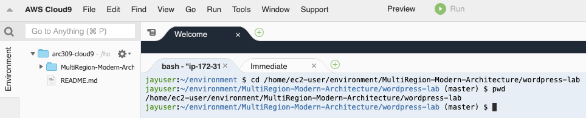
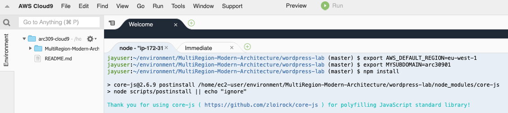
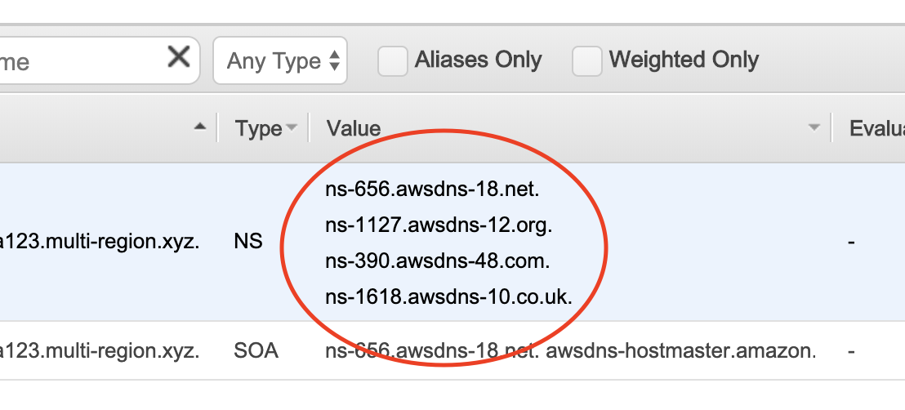
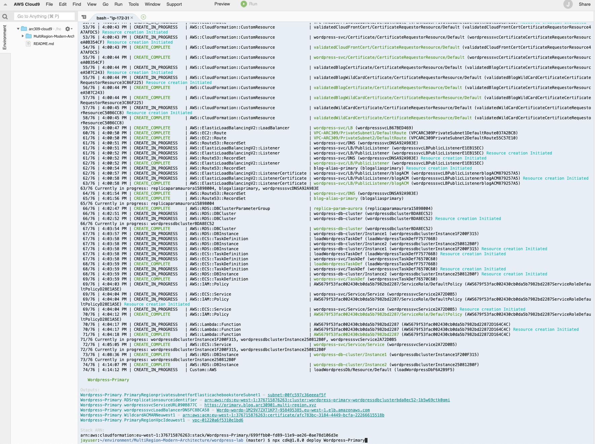
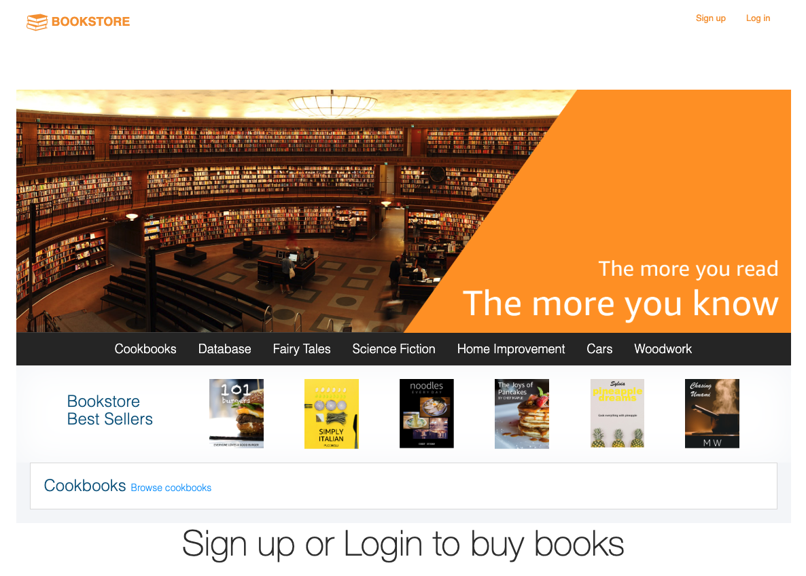

# Building the Bookstore in your Primary Region

In this module, you will deploy the Bookstore application and Wordpress blog in the primary (Ireland, eu-west-1) region using AWS CDK(Cloud Development Kit) and AWS CloudFormation. The solution uses the following components:

1. Module 1-1.

- Fargate and Aurora - Book blog posts with Wordpress (AWS Fargate is a compute engine for Amazon ECS and EKS that allows you to run containers without having to manage servers or clusters)

2. Module 1-2.

- CloudFront and S3 - Web static content, ReactJS files
- API Gateway, AWS Lambda and Cognito - App layer with authentication
- DynamoDB and ElastiCache - Books, Order, Cart tables and Best Seller information

You will also create the IAM polices and roles required by these components.

## 1-1. Building your Book Blog using AWS CDK in your Primary Region (Ireland)

In Cloud9, go to `wordpress-lab` directory
(eg. /home/ec2-user/environment/MultiRegion-Modern-Architecture/wordpress-lab)



Deploy Wordpress for the Book blog using AWS CDK with ALB (Application Load Balancer), AWS Fargate, ACM, and Aurora MySQL in Primary Region (Ireland). Export your own unqiue domain name in Cloud9.

```bash
cd ~/environment/MultiRegion-Modern-Architecture/wordpress-lab/

export AWS_DEFAULT_REGION=eu-west-1
export MYSUBDOMAIN=<enter a 8 char unique subdomain name, eg: team1234>
```

Copy and execute the following command in Cloud9 to install npm and bootstrap and to deploy hostedZone cdk.

```bash
npm install
npx cdk@1.22.0 bootstrap
npx cdk@1.22.0 deploy hostedZone
```

This command `npx cdk@1.22.0 bootstrap` creates an AWS Cloudformation Stack `CDKToolkit` in your Cloudformation console to manages resources necessary for managing your Cloud Applications with AWS CDK, which is an S3 bucket for all the configurations.

Next, we deploy `hostedZone` to spin up the necessary AWS resources to map the domain name, IAM roles and policies and Lambda functions you need to prepare for the app to run on **<YOUR SUBDOMAIN>.multi-region.xyz**.



```
Do you wish to deploy these changes (y/n)?
```

Type "Y", and it will take around 5 min.


- You need `hostedZone.hostedZoneID` information in the module 2.

Now, let's check if the DNS is setup correctly in Route53. Enter the following command to make sure you see that the DNS is resolving to the correct addresses.

```
dig +short NS <<YOUR HOSTED NAME URL>> e.g. myUniqueTeamName.multi-region.xyz
```

Now, compare the results with the the output of CDK, `hostedZone.NameServers`. If they are the same, you can proceed to deploy the Wordpress with the following command.

<!--  -->

```
npx cdk@1.22.0 deploy Wordpress-Primary

Do you wish to deploy these changes (y/n)?
```

Enter "**Y**", and it will take around 20 min. While you are waiting for the CDK completion, you can play with our pre-built Bookstore. (Refer Module 6: [Demo](../6_Demo/README.md) )

**Your Book Blog is completed**

Now, your Book Blog is built with the following url `https://primary.blog.<MYSUBDOMAIN>.multi-region.xyz/` and you can now go to your blog. Note that DNS resolution may take a while to reflect your website.



## 1-2. Building the Bookstore using CloudFormation in your Primary Region (Ireland)

<details><summary>Bookstore Frontend and Backend</summary>

**Frontend**

React Build artifacts are stored in a S3 bucket where web application assets are maintained (like book cover photos, web graphics, etc.). Amazon CloudFront caches the frontend content from S3, presenting the application to the user via a CloudFront distribution. The frontend interacts with Amazon Cognito and Amazon API Gateway only. Amazon Cognito is used for all authentication requests, whereas API Gateway (and Lambda) is used for all API calls interacting across DynamoDB and ElastiCache.

**Backend**

The core of the backend infrastructure consists of Amazon Cognito, Amazon DynamoDB, AWS Lambda, and Amazon API Gateway. The application leverages Amazon Cognito for user authentication, and Amazon DynamoDB to store all of the data for books, orders, and the checkout cart. As books and orders are added, Amazon DynamoDB Streams trigger AWS Lambda functions that update the Amazon ElasticCache for Redis cluster that powers the books leaderboard (best seller).

**Developer Tools**

The frontend code (ReactJS) is hosted in AWS CodeCommit. AWS CodePipeline builds the web application using AWS CodeBuild. After successfully building, CodeBuild copies the build artifacts into a S3 bucket where the web application assets are maintained. Along with uploading to Amazon S3, CodeBuild invalidates the cache so users always see the latest experience when accessing the storefront through the Amazon CloudFront distribution. AWS CodeCommit, AWS CodePipeline, and AWS CodeBuild are used in the deployment and update processes only, not while the application is in a steady-state of use.

</details>

<!--  -->

**Step-by-step instructions**

<!-- To build the Bookstore application using CloudFormation, you need to download the yaml file from [Primary CloudFormation](https://github.com/enghwa/MultiRegion-Modern-Architecture/blob/master/1_PrimaryRegion/arc309_primary.yaml).   -->

1. Let's "grep" all the variables we need from the Wordpress-Primary stack in Cloudformation via the commands below:

```
export cfnAcmArn=`aws cloudformation describe-stacks --stack-name Wordpress-Primary \
--region eu-west-1 \
--query "Stacks[0].Outputs[?OutputKey=='CloudfrontACMARNuseast1'].OutputValue" \
--output text`
echo $cfnAcmArn

export vpcIreland=`aws cloudformation describe-stacks --stack-name Wordpress-Primary \
--region eu-west-1 \
--query "Stacks[0].Outputs[?OutputKey=='PrimaryRegionVpcIdeuwest1'].OutputValue" \
--output text`
echo $vpcIreland

export subnetIreland=`aws cloudformation describe-stacks --stack-name Wordpress-Primary \
--region eu-west-1 \
--query "Stacks[0].Outputs[?OutputKey=='PrimaryRegionprivatesubnetforElasticachebookstoreSubnet1'].OutputValue" \
--output text`
echo $subnetIreland
```

2. Let's create the ReactJS app with this aws command via AWS cloudformation:

```
aws cloudformation create-stack --stack-name MyBookstoreIreland \
--template-url https://arc309-bookstore-eu-west-1.s3-eu-west-1.amazonaws.com/arc309_primary.yaml \
--capabilities CAPABILITY_NAMED_IAM \
--parameters ParameterKey=ProjectName,ParameterValue=bookstore \
ParameterKey=AssetsBucketName,ParameterValue=arc309-ireland-$MYSUBDOMAIN-bookstore \
ParameterKey=MySubDomain,ParameterValue=$MYSUBDOMAIN.multi-region.xyz \
ParameterKey=CloudfrontACMARNuseast1,ParameterValue=$cfnAcmArn \
ParameterKey=bookstoreVPC,ParameterValue=$vpcIreland \
ParameterKey=bookstoreSubnet1,ParameterValue=$subnetIreland \
ParameterKey=SeedRepository,ParameterValue=http://woof.kopi.io/book10.zip
```

It will take around 25 mins. (If you don't want to wait for the CloudFormation completion, you can jump to the "Module 2: [Build a Secondary region](../2_SecondaryRegion/README.md)" to build the same stack in `Singapore`. However, don't forget to come back to verify your Bookstore in Ireland is completed.)

Now, you can go to your [Cloudformation console at Ireland](https://eu-west-1.console.aws.amazon.com/cloudformation/home?region=eu-west-1#) to check if the stack is successfully created. Once your stack has successfully completed, you can go to your app via the AWS Cloudfront URL to verify if it works. You can find it via the output tab under AWS Cloudformation in Wordpress-Primary or enter the below command in Cloud9 to ge the URL:

```
export cloudfronturl=`aws cloudformation describe-stacks --stack-name MyBookstoreIreland --region eu-west-1 --query "Stacks[0].Outputs[?OutputKey=='WebApplication'].OutputValue" --output text`
echo $cloudfronturl
```

Below shows the example of the bookstore website.



### FYI

This Bookstore doesn't include the Book Blog yet that you created with CDK. It will be shown after you complete building the secondary region Bookstore application.
Also, if your bookstore website did not load or experience permission error, please check that the [codepipeline](https://eu-west-1.console.aws.amazon.com/codesuite/codepipeline/pipelines?region=eu-west-1) has successfully build your front-end assets.

## Completion

Congratulations you have configured the bookstore in the primary region (Ireland). In the next module, you will replicate your data (Blog data in Aurora RDS, Web content in S3, Book data in DynamoDB) to the secondary region (Singapore) and build the same Blog and Bookstore application in the secondary region (Singapore) for Resilience and High availability.

Module 2: [Build a Secondary region](../2_SecondaryRegion/README.md)
