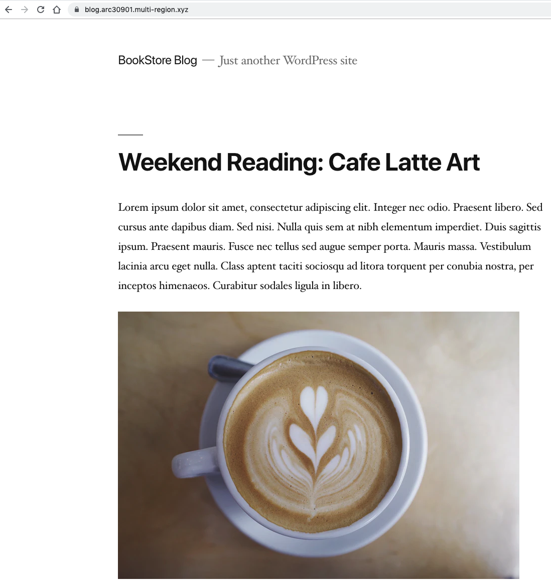
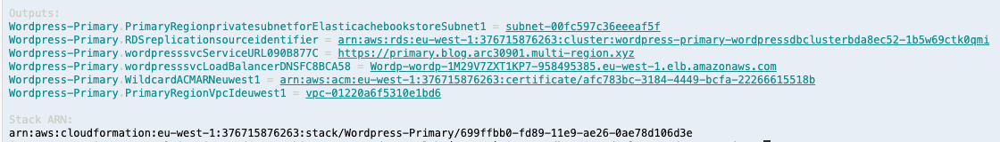
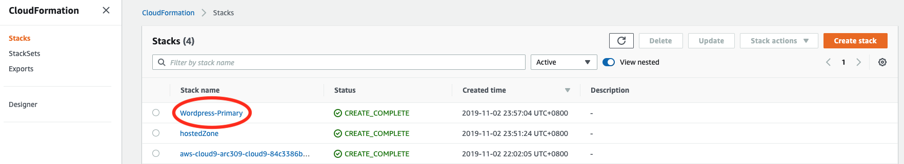
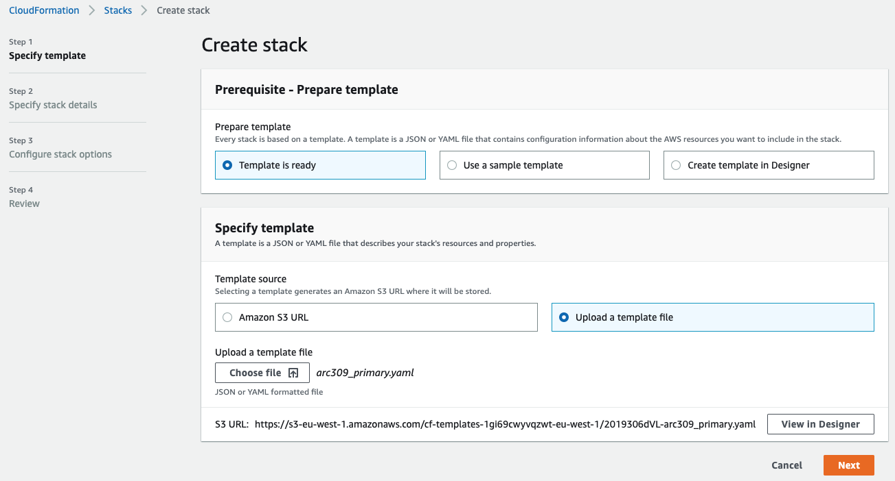
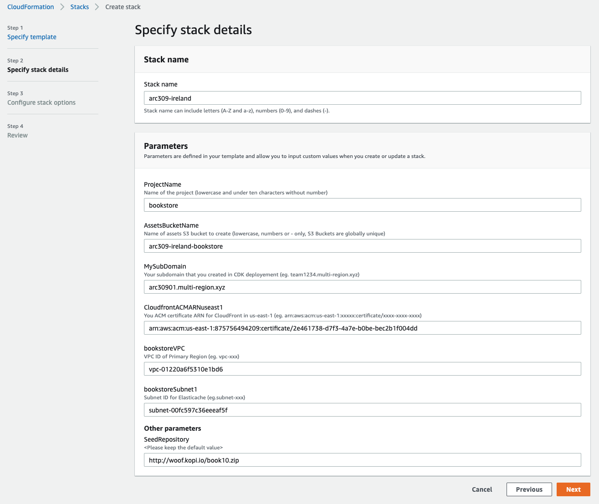
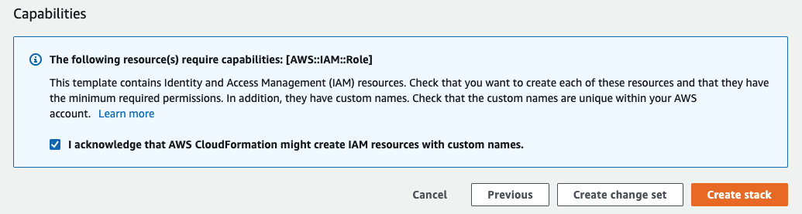
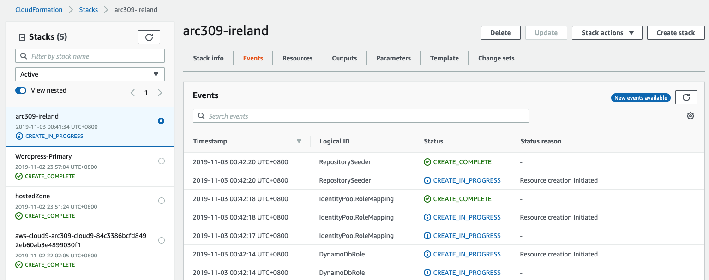

# Building the Bookstore in your Primary Region

In this module, you will deploy the Bookstore application and Wordpress blog in the primary (Ireland, eu-west-1) region using AWS CDK(Cloud Development Kit) and AWS CloudFormation. The solution uses the following components:
1. Fargate and Aurora - Book blog posts with Wordpress (AWS Fargate is a compute engine for Amazon ECS and EKS that allows you to run containers without having to manage servers or clusters)
2. CloudFront and S3 - Web static content, ReactJS files
3. API Gateway, AWS Lambda and Cognito - App layer with authentication
4. DynamoDB and ElastiCache - Books, Order, Cart tables and Best Seller information

You will also create the IAM polices and roles required by these components.

## 1. Building your Book Blog using AWS CDK in your Primary Region (Ireland)

In Cloud9, go to `wordpress-lab` directory 
(eg. /home/ec2-user/environment/MultiRegion-Modern-Architecture/wordpress-lab)


Deploy Wordpress for the Book blog using AWS CDK with ALB (Application Load Balancer), AWS Fargate, ACM, and Aurora MySQL in Primary Region (Ireland). Execute following commands **one by one** in AWS Cloud9.

```bash
cd ~/environment/MultiRegion-Modern-Architecture/wordpress-lab/

export AWS_DEFAULT_REGION=eu-west-1
export MYSUBDOMAIN=<enter a 8 char unique subdomain name, eg: team1234>
npm install
npx cdk@1.8.0 bootstrap
npx cdk@1.8.0 deploy hostedZone
```


```
Do you wish to deploy these changes (y/n)? 
```
Type "Y", and it will take around 5 min.


* You need `hostedZone.hostedZoneID` (Z7VDWLHBQQSCF) information in the module 2.

Now, let's check if the DNS is setup correctly in Route53. Open a new Terminal or iTerm and enter the following command to make sure you see that the DNS is resolving to the correct addresses.
```
dig +short NS <<YOUR HOSTED NAME URL>> e.g. myUniqueTeamName.multi-region.xyz
```


Now, compare the results with the ones in Route53. If they are the same, you can proceed to deploy the Wordpress. If not, please wait another 1 min before you seek help from the AWS instructors.

```
npx cdk@1.8.0 deploy Wordpress-Primary
```

```
Do you wish to deploy these changes (y/n)? 
```
Type "Y", and it will take around 20 min.


**Your Book Blog is completed**

Now, your Book Blog is built. Please verify with following:
```
https://primary.blog.<MYSUBDOMAIN>.multi-region.xyz/

```


You need the VPC ID and Private Subnet ID for the next steps. You can check it in Cloud9 console or Cloudformation output tab in the Primary region (Ireland).


If you can find the VPC ID and Subnet ID (any private subnet in 4 subnets) from the VPC console in Ireland though the CDK is not completed, you can proceed the next step, CloudFormation stack creation.

## 2. Building the Bookstore using CloudFormation in your Primary Region (Ireland)

**Frontend**

Build artifacts are stored in a S3 bucket where web application assets are maintained (like book cover photos, web graphics, etc.). Amazon CloudFront caches the frontend content from S3, presenting the application to the user via a CloudFront distribution. The frontend interacts with Amazon Cognito and Amazon API Gateway only. Amazon Cognito is used for all authentication requests, whereas API Gateway (and Lambda) is used for all API calls interacting across DynamoDB and ElastiCache. 

**Backend**

The core of the backend infrastructure consists of Amazon Cognito, Amazon DynamoDB, AWS Lambda, and Amazon API Gateway. The application leverages Amazon Cognito for user authentication, and Amazon DynamoDB to store all of the data for books, orders, and the checkout cart. As books and orders are added, Amazon DynamoDB Streams trigger AWS Lambda functions that update the Amazon ElasticCache for Redis cluster that powers the books leaderboard (best seller). 

**Developer Tools**

The frontend code (ReactJS) is hosted in AWS CodeCommit. AWS CodePipeline builds the web application using AWS CodeBuild. After successfully building, CodeBuild copies the build artifacts into a S3 bucket where the web application assets are maintained. Along with uploading to Amazon S3, CodeBuild invalidates the cache so users always see the latest experience when accessing the storefront through the Amazon CloudFront distribution.  AWS CodeCommit, AWS CodePipeline, and AWS CodeBuild are used in the deployment and update processes only, not while the application is in a steady-state of use.

<!--  -->

**Step-by-step instructions**

<!-- To build the Bookstore application using CloudFormation, you need to download the yaml file from [Primary CloudFormation](https://github.com/enghwa/MultiRegion-Modern-Architecture/blob/master/1_PrimaryRegion/arc309_primary.yaml).   -->

Before you create the Bookstore application in Ireland, 
go to the CloudFormation console in `Ireland` and find the VPC id and Subnet id in `Outputs` tab in `Wordpress-Primary` stack.



1. You can create stack with the below `Launch Stack` button.  

Region name | Region code | Launch
--- | --- | ---
EU (Ireland) |	eu-west-1 | [](https://console.aws.amazon.com/cloudformation/home?region=eu-west-1#/stacks/new?stackName=MyBookstoreIreland&templateURL=https://arc309-bookstore-eu-west-1.s3-eu-west-1.amazonaws.com/arc309_primary.yaml) 



2. Fill out `Parameters`
* **ProjectName**: 10 characters with lowercase (no number is allowed) (eg.bookstore)
* **AssetsBucketName**: **Unique** S3 bucket name with lowercase (eg.arc309-ireland-bookstore)
* **MySubDomain**: Subdomain that you created in CDK deployement (eg. team1234.multi-region.xyz)
* **CloudfrontACMARNuseast1**: You ACM certificate ARN for CloudFront in us-east-1 (eg. arn:aws:acm:us-east-1:xxxxx:certificate/xxxx-xxxx-xxxx)
* **bookstoreVPC**: VPC id (output of previous cdk, vpc-xxxxxxxxxx)
* **bookstoreSubnet1**: Subnet id for Elasticache (output of previous cdk, subnet-xxxxxxxxxx)
* **SeedRepository**: Web file (keep default value)

3. Skip the `Configure stack options` and check the box of `I acknowledge that AWS CloudFormation might create IAM resources with custom names.` in `Review` step. Select `Create stack`.


This CloudFormation template may take around 15 mins. You can hop over the progress of resources creation in `Events` tab in CloudFormation. 


Once your stack has successfully completed, navigate to the `Outputs` tab of your stack
where you can find an `WebApplication` output that includes a CloudFront Domain name. Type this URL in your browser and check your Bookstore application.

To save time in this step due to Cloudfront distribution creation, once you have confirm that the S3 bucket and DynamoDB tables, you can proceed to [the next lab module](../2_SecondaryRegion/README.md). However, do remember to check back later that this Cloudformation is fully created.

```
https://d1zltjarei3438.cloudfront.net/
```


### FYI
This Bookstore doesn't include the Book Blog yet that you created with CDK. It will be shown after you complete building the secondary region Bookstore application.
Also, if your bookstore website did not load or experience permission error, please check that the [codepipeline](https://eu-west-1.console.aws.amazon.com/codesuite/codepipeline/pipelines?region=eu-west-1) has successfully build your front-end assets.

## Completion

Congratulations you have configured the bookstore in the primary region (Ireland). In the next module, you will replicate your data (Blog data in Aurora RDS, Web content in S3, Book data in DynamoDB) to the secondary region (Singapore) and build the same Blog and Bookstore application in the secondary region (Singapore) for Resilience and High availability. 

Module 2: [Build a Secondary region](../2_SecondaryRegion/README.md)
