# Building the Bookstore in your Secondary Region (Singapore)

We completed building the bookstore in the primary region (Ireland) in the previous module. In this module, we will build the same Bookstore in Singapore region and configure the replication of Aurora MySQL for the Blog content, S3 bucket for static contects, and DynamoDB tables for the books/order/cart data from the primary region (Ireland) to the secondary region (Singapore).

## 2-1. Building your Book Blog using AWS CDK in your Secondary Region (Singapore)

Go back to your Cloud9 (that you created in `Ireland`), and execute following commands. It will take around 15 mins.

<!--
* **hostedZoneID**: Get this information from the output of CDK or CloudFormation in the module 1. (eg.Z7VDWLHBQQSCF)
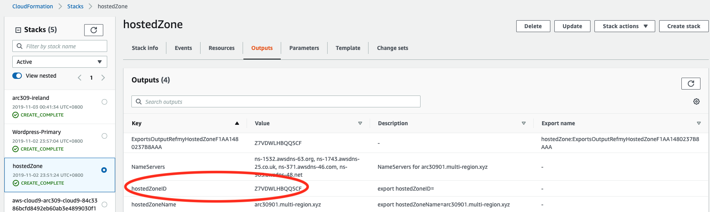
* Your `MYSUBDOMAIN` was previously exported in module 1.
-->

Let's make sure your environment variable MYSUBDOMAIN is correctly set. Enter the same MYSUBDOMAIN as you did previously from module 1.

```
export MYSUBDOMAIN=<enter a 8 char unique subdomain name with lower case, eg: team1234>
```

Similar to Ireland region, before you do the S3 replication, let's create the new S3 bucket for the reactJS app in Singapore (ap-southeast-1) region.

```
aws s3api create-bucket \
  --bucket arc309-singapore-$MYSUBDOMAIN-bookstore \
  --region ap-southeast-1 \
  --create-bucket-configuration LocationConstraint=ap-southeast-1
```

```
cd ~/environment/MultiRegion-Modern-Architecture/wordpress-lab/

export hostedZoneID=`aws cloudformation describe-stacks --stack-name hostedZone --region eu-west-1 \
 --query "Stacks[0].Outputs[?OutputKey=='hostedZoneID'].OutputValue" --output text`
export hostedZoneName=$MYSUBDOMAIN.multi-region.xyz
export AWS_DEFAULT_REGION=ap-southeast-1
npx cdk@1.22.0 bootstrap
npx cdk@1.22.0 deploy Wordpress-Secondary
```

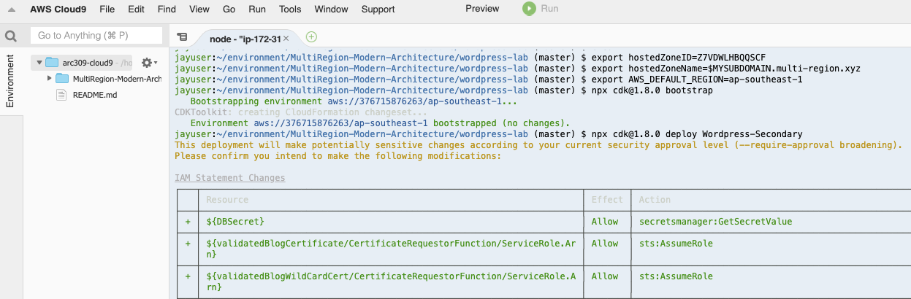

`Do you wish to deploy these changes (y/n)?`. Enter "**y**"


Now, your Book Blog in Singapore is completed. However, you will find `503 Service Temporarily Unavailable` error if you verify `https://secondary.blog.<MYSUBDOMAIN>.multi-region.xyz/` as the wordpress is not connected the Aurora MySQL in Singapore region yet. We will configure this in the next section.

## 2-2. Replication of Aurora, S3, and DynamoDB

In this section, we will configure the replication of Aurora MySQL for the Blog content, S3 bucket for static contents, and DynamoDB tables for the books/order/cart data from the primary region (Ireland) to the secondary region (Singapore).

However, replication of Aurora MySQL and S3 is optional configuration for the Bookstore Failover testing in the next module. Hence, you can skip it now if you have no time to configure.

### 1. Enable Aurora MySQL Read replica in Singapore region (Optional)

<details><summary>
Aurora MySQL Read replica helps you have a redundancy plan. The replica in `Singapore` region can be promoted as the primary database when the primary database in the primary region (`Ireland`) has issues.</summary>

Go back to Cloud9, and execute the following commands to enable the read replica of Aurora MySQL in `Singapore` region
from Ireland region using the AWS CLI.

- `replication-source-identifier`: Get from Cloudformation stack `Wordpress-Primary` in Ireland Region. Or use the following command in Cloud9.

```
export ReplicationSourceIdentifier=`aws cloudformation describe-stacks --stack-name Wordpress-Primary --region eu-west-1 \
    --query "Stacks[0].Outputs[?OutputKey=='RDSreplicationsourceidentifier'].OutputValue" --output text`
echo $ReplicationSourceIdentifier
```

- `vpc-security-group-ids`: Get from Cloudformation stack `Wordpress-Secondary` in Singapore Region. Or use the following command in Cloud9.

```
export VpcSecurityGroupIds=`aws cloudformation describe-stacks --stack-name Wordpress-Secondary --region ap-southeast-1 \
    --query "Stacks[0].Outputs[?OutputKey=='WordpressDBsecurityGroupId'].OutputValue" --output text`
echo $VpcSecurityGroupIds
```

CLI to create read replica of Aurora MySQL in Singapore region.

```
aws rds create-db-cluster \
  --db-cluster-identifier arc309-replica-cluster \
  --engine aurora \
  --replication-source-identifier $ReplicationSourceIdentifier \
  --vpc-security-group-ids $VpcSecurityGroupIds \
  --db-subnet-group-name secondaryregion-wordpressdb-subnetgroup \
  --source-region eu-west-1 \
  --region ap-southeast-1
```

Verify the RDS replication cluster is created in Singapore region.

```
aws rds describe-db-clusters --db-cluster-identifier arc309-replica-cluster --region ap-southeast-1
```

Create RDS read replica instance.

```
aws rds create-db-instance \
  --db-instance-identifier arc309-replica-instance \
  --db-cluster-identifier arc309-replica-cluster \
  --db-instance-class db.t3.small \
  --engine aurora \
  --region ap-southeast-1
```

Verify RDS cluster creation in [RDS console in Singapore region](https://ap-southeast-1.console.aws.amazon.com/rds/home?region=ap-southeast-1#databases:).
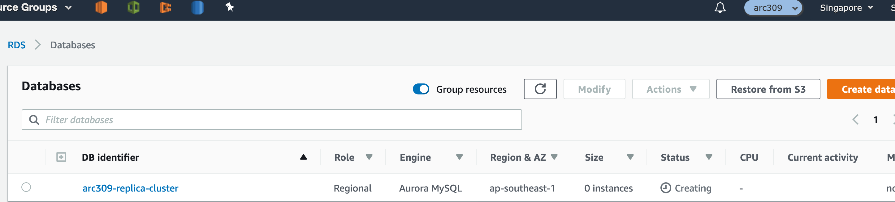

Provisioning the Aurora replica instance can take a while takes for a while, you can procced the next step while the instance is being deployed.

</details>

### 2. Enable S3 replication for Web contents replication (Optional)

<details><summary>This S3 replication will replicate the static contents from Ireland region to Singapore whenever there is an update. </summary>

Follow the steps to enable the S3 replication using the AWS CLI in Cloud9. The destination bucket name should be `your bucket name in Singarpore` that you created above such as `arc309-singapore-$MYSUBDOMAIN-bookstore`.

```bash
aws s3api put-bucket-versioning \
  --bucket arc309-singapore-$MYSUBDOMAIN-bookstore \
  --versioning-configuration Status=Enabled
```

```bash
aws s3 website s3://<arc309-singapore-$MYSUBDOMAIN-bookstore>/ --index-document index.html
```

<!-- $ aws iam create-role \
--role-name crrRole \
--assume-role-policy-document file://s3-role-trust-policy.json

$ aws iam put-role-policy \
--role-name crrRole \
--policy-document file://s3-role-permissions-policy.json \
--policy-name crrRolePolicy \ -->

Add replication configuration to the source bucket in Ireland region. Save the following JSON in a file called replication.json to the your Cloud9. You need S3 replication role ARN for this exercise. You can find it in the output table of your CloudFormation stack (MyBookstoreIreland) in Ireland or execute following command in the Cloud9.

```bash
export ReplicationArnRole=`aws cloudformation describe-stacks --stack-name MyBookstoreIreland --region eu-west-1 \
     --query "Stacks[0].Outputs[?OutputKey=='S3replicationRole'].OutputValue" --output text`
```

copy and paste the following command to create a replication.json file:

```
echo '{
  "Role": "'$ReplicationArnRole'",
  "Rules": [
    {
      "Status": "Enabled",
      "Priority": 1,
      "DeleteMarkerReplication": { "Status": "Disabled" },
      "Filter": {},
      "Destination": {
        "Bucket": "arn:aws:s3:::arc309-singapore-'$MYSUBDOMAIN'-bookstore"
      }
    }
  ]
}' > replication.json
```

```
aws s3api put-bucket-replication \
  --replication-configuration file://replication.json \
  --bucket arc309-ireland-$MYSUBDOMAIN-bookstore
```

You can check the replication configuration in S3 console.
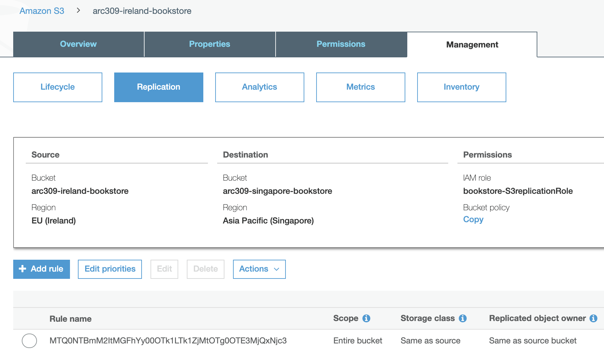

S3 doesn't replicate objects retroactively. S3 Objects that existed before you added the replication configuration to the bucket aren't replicated to the new desination bucket. Hence, you need to sync the existing content to the new bucket in Singapore with following command.

```bash
aws s3 sync s3://arc309-ireland-$MYSUBDOMAIN-bookstore s3://arc309-singapore-$MYSUBDOMAIN-bookstore
```

</details>

### 3. Enable DynamoDB Global Tables using Console

Let's take a look at continuous replicating the data in DynamoDB from the primary region (Ireland) to the
secondary region (Singapore) so that there is always a backup.

We will be using a feature of `DynamoDB Global Tables` for this. Any changes
made to any items in any replica tables will be replicated to all of the other
replicas within the same global table. In a global table, a newly-written item is
usually propagated to all replica tables within seconds.

However, conflicts can arise if applications update the same item in different
regions at about the same time. To ensure eventual consistency, DynamoDB global tables
use a “last writer wins” reconciliation between concurrent updates, where DynamoDB makes
a best effort to determine the last writer.

Follow the steps to create a global table of Book, Order, Cart form the Ireland to Singapore regions using the console.

Go to DynamoDB in Ireland. Select `Books` table, go to `Global Tables` tab, and click `Add region`
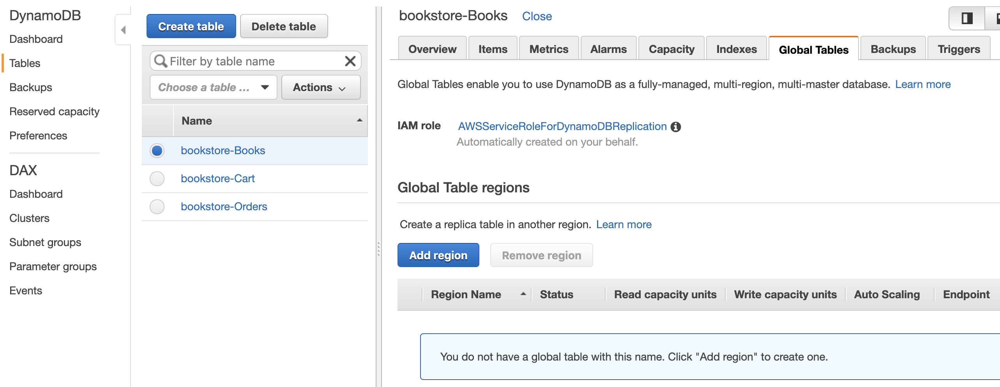

Select `Singapore`, and click `Continue`.
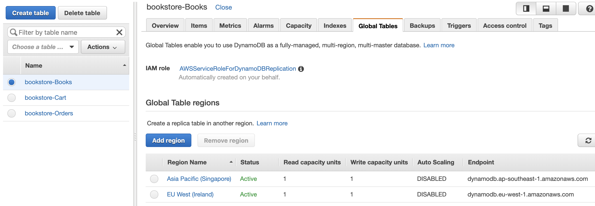

If you get the `Internal Error` message in the creation, please close the window and try again.

Do the same steps or `bookstore-Orders` and `bookstore-Cart` tables.

<!-- aws dynamodb create-table \
    --table-name <Books table name> \
    --attribute-definitions \
        AttributeName=id,AttributeType=S \
        AttributeName=category,AttributeType=S \
    --key-schema \
        AttributeName=id,KeyType=HASH \
    --provisioned-throughput \
        ReadCapacityUnits=1,WriteCapacityUnits=1 \
    --global-secondary-indexes IndexName=category-index,KeySchema=[{AttributeName=category,KeyType=HASH}],Projection={ProjectionType=ALL},ProvisionedThroughput={ReadCapacityUnits=1,WriteCapacityUnits=1} \
    --stream-specification StreamEnabled=true,StreamViewType=NEW_AND_OLD_IMAGES \
    --region <region2>

aws dynamodb create-table \
    --table-name <Order table name> \
    --attribute-definitions \
        AttributeName=customerId,AttributeType=S \
        AttributeName=orderId,AttributeType=S \
    --key-schema \
        AttributeName=customerId,KeyType=HASH \
        AttributeName=orderId,KeyType=RANGE \
    --provisioned-throughput \
        ReadCapacityUnits=1,WriteCapacityUnits=1 \
    --stream-specification StreamEnabled=true,StreamViewType=NEW_AND_OLD_IMAGES \
    --region <region2>

aws dynamodb create-table \
    --table-name <Cart table name> \
    --attribute-definitions \
        AttributeName=customerId,AttributeType=S \
        AttributeName=bookId,AttributeType=S \
    --key-schema \
        AttributeName=customerId,KeyType=HASH \
        AttributeName=bookId,KeyType=RANGE \
    --provisioned-throughput \
        ReadCapacityUnits=1,WriteCapacityUnits=1 \
    --stream-specification StreamEnabled=true,StreamViewType=NEW_AND_OLD_IMAGES \
    --region <region2>

aws dynamodb create-global-table \
    --global-table-name <Book table name>  \
    --replication-group RegionName=<region1> RegionName=<region2> \
    --region <region2> -->

Now, you completed the replication across two regions for Aurora MySQL, S3, and DynamoDB. It's time to build the Bookstore eb/App layer in Singapore.

## 2-3. Building the Bookstore using Cloudformation in your Secondary Region (Singapore)

**Step-by-step instructions**

1. Let's "grep" all the variables we need from the Wordpress-Primary stack in Cloudformation via the commands below:

```
export vpcSingapore=`aws cloudformation describe-stacks --stack-name Wordpress-Secondary \
--region ap-southeast-1 \
--query "Stacks[0].Outputs[?OutputKey=='SecondaryRegionVpcIdapsoutheast1'].OutputValue" \
--output text`
echo $vpcSingapore

export subnetSingapore=`aws cloudformation describe-stacks --stack-name Wordpress-Secondary \
--region  ap-southeast-1 \
--query "Stacks[0].Outputs[?OutputKey=='SecondaryRegionprivatesubnetforElasticache'].OutputValue" \
--output text`
echo $subnetSingapore

export orderDdbArn=`aws dynamodb describe-table --table-name bookstore-Orders \
--region ap-southeast-1 \
--query 'Table.LatestStreamArn'`
echo $orderDdbArn

export cognitoIrelandPool=`aws cloudformation describe-stacks --stack-name MyBookstoreIreland \
--region eu-west-1 \
--query "Stacks[0].Outputs[?OutputKey=='UserPool'].OutputValue" \
--output text`
echo $cognitoIrelandPool
```

2. Let's create the ReactJS app with this aws command via AWS cloudformation:

```
aws cloudformation create-stack --stack-name MyBookstoreSingapore \
--template-url https://arc309-bookstore-ap-southeast-1.s3-ap-southeast-1.amazonaws.com/arc309_secondary.yaml \
--capabilities CAPABILITY_NAMED_IAM \
--parameters ParameterKey=ProjectName,ParameterValue=bookstore \
ParameterKey=AssetsBucketName,ParameterValue=arc309-singapore-$MYSUBDOMAIN-bookstore \
ParameterKey=bookstoreVPC,ParameterValue=$vpcSingapore \
ParameterKey=bookstoreSubnet1,ParameterValue=$subnetSingapore \
ParameterKey=OrderTableStreamARN,ParameterValue=$orderDdbArn \
ParameterKey=UserPool,ParameterValue=$cognitoIrelandPool
```

This CloudFormation template may take around 10 mins. You can proceed the next steps.

## Update Blog DB connection with Read Replica in Singapore (Optional)

As we mentioned above, the replication of Aurora MySQL is optional configuration for the Bookstore Failover testing in the next module. Hence, you can skip it now if you have no time to configure.

<details><summary>Update Blog DB connection with Read Replica in Singapore (Optional)</summary>

You remember the Book Blog you created above had `503 Service Temporarily Unavailable` error due to the Fargate didn't connect to Aurora MySQL in `Singapore`. You can find the endpoint of Read Replica in Singapore with the following commands:

```bash
aws rds describe-db-instances \
--db-instance-identifier arc309-replica-instance \
--region ap-southeast-1 \
--query "DBInstances[0].Endpoint.Address" --output text
```

Go to `ECS` in Singapore region, select `WordpressSecondarywordpresssvcTaskDefXXXXXXXX` task in `Task Definition`, and click `Create new revision`.
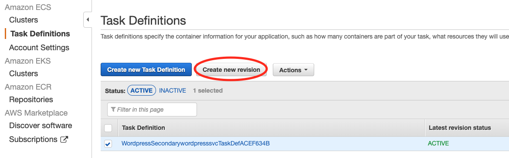
Select `web` container and update `WORDPRESS_DB_HOST` with the above Aurora Read Replica endpoint. Click `Update`.
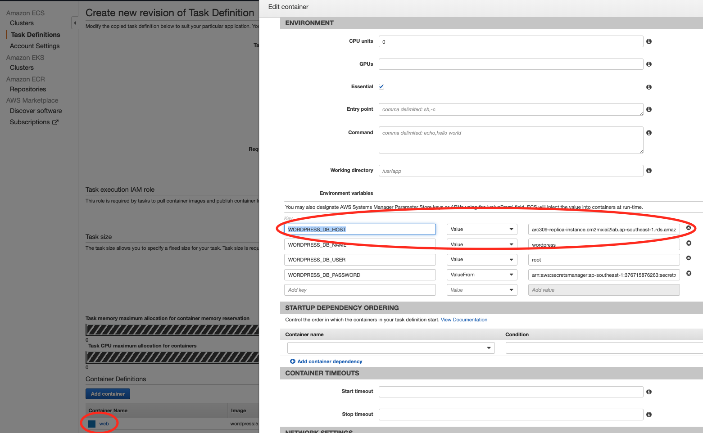

It goes back to `Create new revision of Task Definition` screen. Please scroll down and click `Create` button.

And we need to update the password in AWS Secrets Manager in Singapore to connect the Aurora Read Replica in Singapore.

The following command will update the Secrets Manager `wordpressDBPassword` in Singapore to the same value as the `wordpressDBPassword` in Ireland:

```bash
AWS_ACCOUNTID=$(aws sts get-caller-identity --query Account --output text)

aws secretsmanager update-secret \
--secret-id arn:aws:secretsmanager:ap-southeast-1:$AWS_ACCOUNTID:secret:wordpressDBPassword \
--secret-string \
$(aws secretsmanager get-secret-value \
--secret-id arn:aws:secretsmanager:eu-west-1:$AWS_ACCOUNTID:secret:wordpressDBPassword \
--region eu-west-1 \
--query "SecretString" --output text) \
--region ap-southeast-1
```

### Update Wordpress ECS Service

1. Go to `ECS` in `Singapore` Region, select the cluster `Wordpress-Secondary-ecscluster6XXXXXXX`
2. Select the `Wordpress-Secondary-wordpresssvcSXXXXX` service and click `Update`, make sure the latest task definition is selected.
3. Click `Next` 3 times and finally `Update Service`.

Your blog in the secondary region is now configured, it will be in Read-only mode as it is connected to the read-replica of our Aurora RDS cluster in Singapore.

</details>

## Update Blog WebAsset URL with Wordpress Application Load Balancer

Find your code repo in `CodeCommit` and edit `wordpressconfig.ts` (under bookstore-WebAssets/src/wordpressconfig.ts) in `Ireland` region with your own domain name.
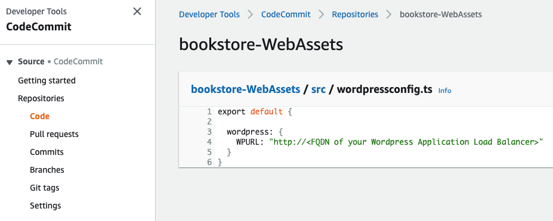

Update `http://<FQDN of your Wordpress Application Load Balancer>` to

```javascript
export default {
  wordpress: {
    WPURL: 'https://blog.<your subdomain>.multi-region.xyz'
  }
};
```

Enter any `Author name` and `Email address`, and click `Commit changes`. You can check the progress in CodePipeline and CodeBuild.
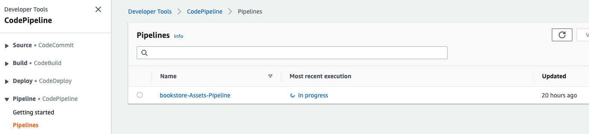

## Create CloudFront Origin Group for both S3 buckets in primary and secondary regions (Optional)

Origin Failover of CloudFront distributions improves the availability of content delivered to end users. However, this is an optional configuration for the Bookstore Failover testing in the next module. Hence, you can skip it now if you have no time to configure.

<details><summary>Create CloudFront Origin Group (Optional)</summary>

With CloudFront’s Origin Failover capability, your content is served from your secondary origin (Singapore) if CloudFront detects that your primary origin (Ireland) is unavailable.

<!-- For example, you can have two Amazon S3 buckets that serve as your origin, that you independently upload your content to. If an object that CloudFront requests from your primary bucket is not present or if connection to your primary bucket times-out, CloudFront will request the object from your secondary bucket. So, you can configure CloudFront to trigger a failover in response to either HTTP 4xx or 5xx status codes. -->

Click your CloudFront Distributions, and click on the "Origins and Origin Groups" tab.
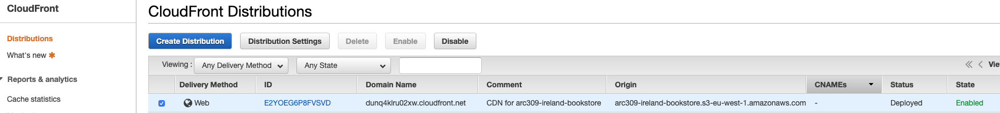

Create the second origin (in Singapore).


Type your `Orgin Domain Name` with `<your Singapore S3 bucket name>.s3-ap-southeast-1.amazonaws.com` and select the options like the following.
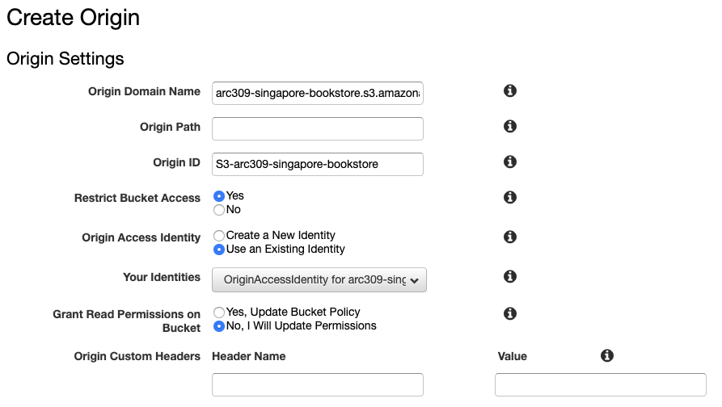

Next, create an origin group.
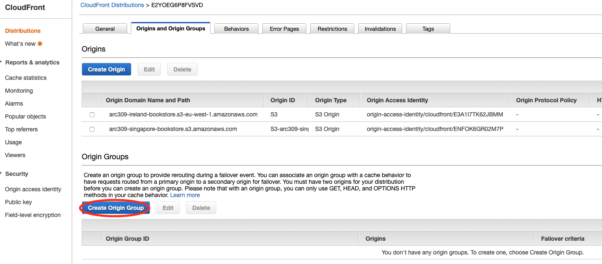
CloudFront automatically switches to the secondary origin when the primary origin returns specific HTTP status code failure responses.
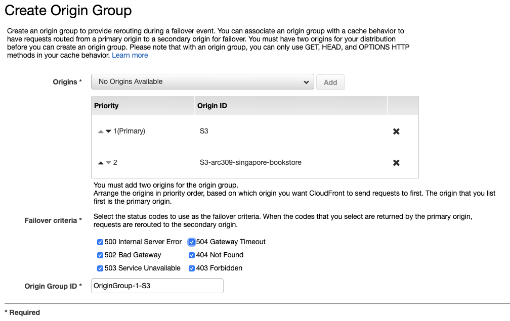

<!-- ## Update CloudFront Domain Name with your domain

Update CloudFront Domain Name (eg. xxxxxxxxx.cloudfront.net) to `$MYSUBDOMAIN.multi-region.xyz`.
Go to CloudFront, and edit `Alternate Domain Names` in `General` tab.
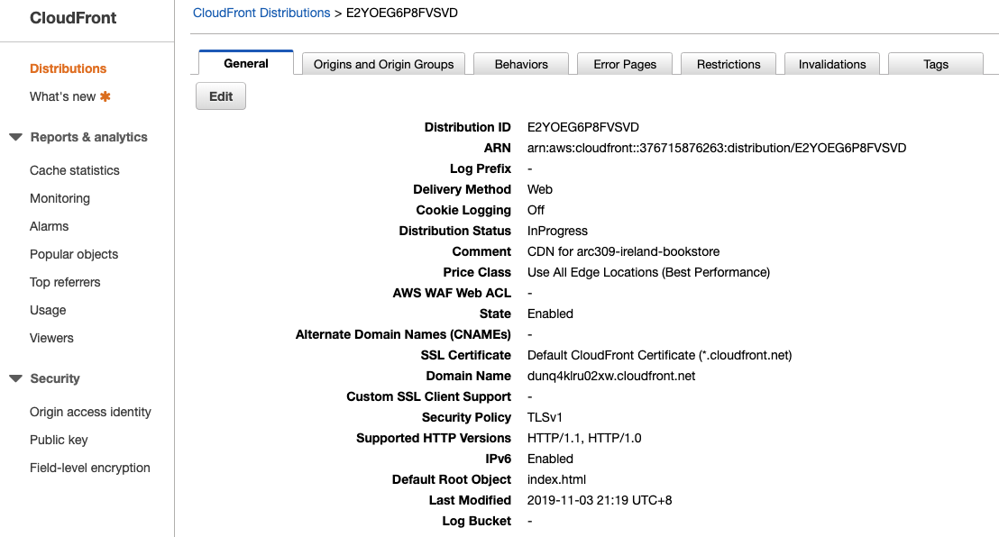

Update `Alternate Domain Names` with your Domain name and select your ACM Certifacte created by CDK in module 1.
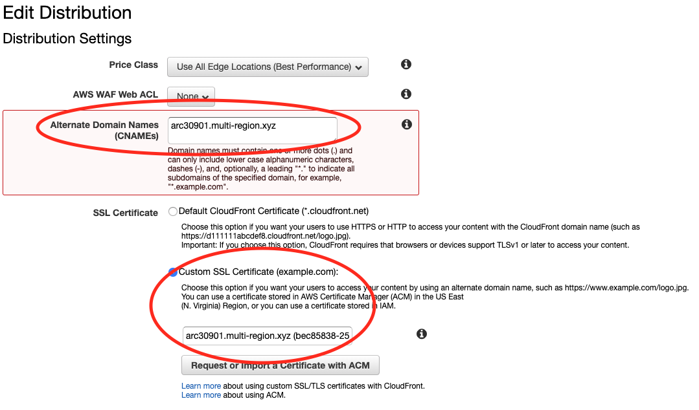 -->

</details>

## Completion

Congratulations! You have successfully deployed Bookstore applications in Ireland and Singapore. In the next module you will configure active/active solution using Route53.

Module 3: [Configure Active-Active Route53](../3_Route53Configuration/README.md)
