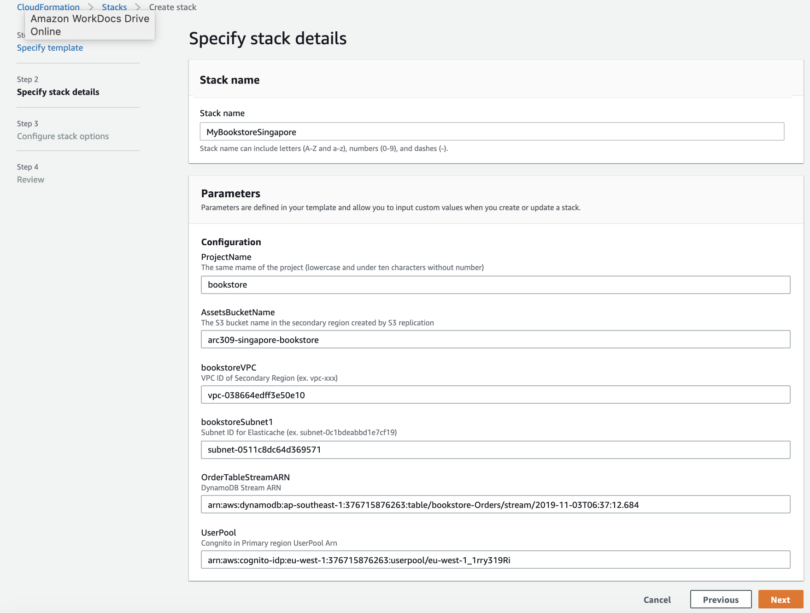

# Building the Bookstore in your Secondary Region (Singapore)

We completed building the bookstore in the primary region (Ireland) in the previous module. In this module, we will build the same Bookstore in Singapore region and configure the replication of Aurora MySQL for the Blog content, S3 bucket for static contects, and DynamoDB tables for the books/order/cart data from the primary region (Ireland) to the secondary region (Singapore).

## Building your Book Blog using AWS CDK in your Secondary Region (Singapore)

Go back to your Cloud9, and execute following commands.It will take around 15 mins. (It should be executed under `wordpress-lab` directory)
* **hostedZoneID**: Get this information from the output of CDK or CloudFormation in the module 1. (ex.Z7VDWLHBQQSCF)

* Your `MYSUBDOMAIN` was previously exported in module 1.

```bash
export hostedZoneID=<route53 hosted zone ID of MYSUBDOMAIN.multi-region.xyz>
export hostedZoneName=$MYSUBDOMAIN.multi-region.xyz
export AWS_DEFAULT_REGION=ap-southeast-1
npx cdk@1.8.0 bootstrap
npx cdk@1.8.0 deploy Wordpress-Secondary

```


Type "y" on `Do you wish to deploy these changes (y/n)?`.


Now, your Book Blog in Singapore is completed. However, you will find `503 Service Temporarily Unavailable` error if you verify `https://secondary.blog.<MYSUBDOMAIN>.multi-region.xyz/` as the wordpress is not connected the Aurora MySQL in Singapore region yet. We will configure this in the next section.

## Replication of Aurora, S3, and DynamoDB 

In this section, we will configure the replication of Aurora MySQL for the Blog content, S3 bucket for static contects, and DynamoDB tables for the books/order/cart data from the primary region (Ireland) to the secondary region (Singapore).

### 1. Enable Aurora MySQL Read replica in Singapore region

Aurora MySQL Read replica helps you have redundancy plan. The replica in Singapore region can be promoted as the primary database when the primary database in the primary region (Ireland) has issues.

Go back to Cloud9, and execute the following command to enable the read replica of Aurora MySQL in Singapore region
from Ireland region using the AWS CLI. 

* `replication-source-identifier`: Get from Cloudformation stack `Wordpress-Primary` in Ireland Region. Or use the following command in Cloud9.
```bash
aws cloudformation describe-stacks --stack-name Wordpress-Primary --region eu-west-1 \
    --query "Stacks[0].Outputs[?OutputKey=='RDSreplicationsourceidentifier'].OutputValue" --output text

```

* `vpc-security-group-ids`: Get from Cloudformation stack `Wordpress-Secondary` in Singapore Region. Or use the following command in Cloud9. 
```bash
aws cloudformation describe-stacks --stack-name Wordpress-Primary --region ap-southeast-1 \
    --query "Stacks[0].Outputs[?OutputKey=='WordpressDBsecurityGroupName'].OutputValue" --output text
```

CLI to create read replica of Aurora MySQL in Singapore region. 
```bash
aws rds create-db-cluster \
  --db-cluster-identifier <arc309-replica-cluster> \
  --engine aurora \
  --replication-source-identifier <arn:aws:rds:eu-west-1:xxxxxxxxxx:xxxxxxxxx> \
  --vpc-security-group-ids <sg-xxxxxxxxx> \
  --db-subnet-group-name <SecondaryRegion-WordpressDB-subnetgroup> \
  --source-region <eu-west-1> \
  --region <ap-southeast-1>
```

Verify the RDS replication cluster is created in Singapore region.
```bash
aws rds describe-db-clusters --db-cluster-identifier <arc309-replica-cluster> --region <ap-southeast-1>
```
Create RDS read replica instance. 

```bash
aws rds create-db-instance \
  --db-instance-identifier <arc309-replica-instance> \
  --db-cluster-identifier <arc309-replica-cluster> \
  --db-instance-class <db.t3.small> \
  --engine aurora \
  --region <ap-southeast-1>
```

Verify RDS replication in RDS console in Singapore region or using CLI in Cloud9.


It takes for a while, you can procced the next step first.

### 2. Enable S3 replication for Web contents replication

This S3 replication will replicate the static contents from Irelad region to Singapore whenever there is update. 
Follow the steps to enable the S3 replication using the AWS CLI in Cloud9.

```bash
aws s3api create-bucket \
  --bucket <arc309-singapore-bookstore> \
  --region <ap-southeast-1> \
  --create-bucket-configuration LocationConstraint=<ap-southeast-1>
```
```bash
aws s3api put-bucket-versioning \
  --bucket <arc309-singapore-bookstore> \
  --versioning-configuration Status=Enabled
```

<!-- aws s3 website s3://<AssetsBucketName-region2>/ --index-document index.html -->

<!-- $ aws iam create-role \
--role-name crrRole \
--assume-role-policy-document file://s3-role-trust-policy.json 

$ aws iam put-role-policy \
--role-name crrRole \
--policy-document file://s3-role-permissions-policy.json \
--policy-name crrRolePolicy \ -->

Add replication configuration to the source bucket in Ireland region. Save the following JSON in a file called replication.json to the your Cloud9. You need S3 replication role ARN for this exercise. You can find it in the output table of your CloudFormation stack (ex.arc309-ireland) in Ireland or execute following command in the Cloud9.

```bash
aws cloudformation describe-stacks --stack-name <arc309-ireland> --region eu-west-1 \
    --query "Stacks[0].Outputs[?OutputKey=='S3replicationRole'].OutputValue" --output text
```

To create `replication.json` file in the Cloud9, 
```bash
$vi replication.json
esc+i: insert
```
copy and paste the following and save with `esc+wq!`.

```
{
  "Role": "<IAM-role-ARN>",
  "Rules": [
    {
      "Status": "Enabled",
      "Priority": 1,
      "DeleteMarkerReplication": { "Status": "Disabled" },
      "Filter": {},
      "Destination": {
        "Bucket": "arn:aws:s3:::<arc309-singapore-bookstore>"
      }
    }
  ]
}
```

```bash
aws s3api put-bucket-replication \
  --replication-configuration file://replication.json \
  --bucket <arc309-ireland-bookstore>
```

You can check the replication configuration in S3 console.


### 3. Enable DynamoDB Global Tables using Console

Let's take a look at continuously replicating the data in DynamoDB from the primary region (Ireland) to the
secondary region (Singapore) so that there is always a backup.

We will be using a feature of DynamoDB Global Tables for this. Any changes 
made to any items in any replica tables will be replicated to all of the other 
replicas within the same global table. In a global table, a newly-written item is 
usually propagated to all replica tables within seconds.

However, conflicts can arise if applications update the same item in different 
regions at about the same time. To ensure eventual consistency, DynamoDB global tables 
use a “last writer wins” reconciliation between concurrent updates, where DynamoDB makes 
a best effort to determine the last writer. 

Follow the steps to create a global table of Book, Order, Cart form the Ireland to Singapore regions using the console. 

Go to DynamoDB in Ireland. Select `Books` table, go to `Global Tables` tab, and click `Add region`


Select `Singapore`, and click `Continue`.


Do the same steps or `Orders` and `Cart` tables.

<!-- aws dynamodb create-table \
    --table-name <Books table name> \
    --attribute-definitions \
        AttributeName=id,AttributeType=S \
        AttributeName=category,AttributeType=S \
    --key-schema \
        AttributeName=id,KeyType=HASH \
    --provisioned-throughput \
        ReadCapacityUnits=1,WriteCapacityUnits=1 \
    --global-secondary-indexes IndexName=category-index,KeySchema=[{AttributeName=category,KeyType=HASH}],Projection={ProjectionType=ALL},ProvisionedThroughput={ReadCapacityUnits=1,WriteCapacityUnits=1} \
    --stream-specification StreamEnabled=true,StreamViewType=NEW_AND_OLD_IMAGES \
    --region <region2>

aws dynamodb create-table \
    --table-name <Order table name> \
    --attribute-definitions \
        AttributeName=customerId,AttributeType=S \
        AttributeName=orderId,AttributeType=S \
    --key-schema \
        AttributeName=customerId,KeyType=HASH \
        AttributeName=orderId,KeyType=RANGE \
    --provisioned-throughput \
        ReadCapacityUnits=1,WriteCapacityUnits=1 \
    --stream-specification StreamEnabled=true,StreamViewType=NEW_AND_OLD_IMAGES \
    --region <region2>

aws dynamodb create-table \
    --table-name <Cart table name> \
    --attribute-definitions \
        AttributeName=customerId,AttributeType=S \
        AttributeName=bookId,AttributeType=S \
    --key-schema \
        AttributeName=customerId,KeyType=HASH \
        AttributeName=bookId,KeyType=RANGE \
    --provisioned-throughput \
        ReadCapacityUnits=1,WriteCapacityUnits=1 \
    --stream-specification StreamEnabled=true,StreamViewType=NEW_AND_OLD_IMAGES \
    --region <region2>

aws dynamodb create-global-table \
    --global-table-name <Book table name>  \
    --replication-group RegionName=<region1> RegionName=<region2> \
    --region <region2> -->

Now, you completed the replication across two regions for Aurora MySQL, S3, and DynamoDB. It's time to build the Bookstore eb/App layer in Singapore. 

## Building the Bookstore using Cloudformation in your Secondary Region (Singapore)

**Step-by-step instructions**

To build the Bookstore application using CloudFormation, you need to download the yaml file from [Secondary CloudFormation](https://github.com/enghwa/MultiRegion-Modern-Architecture/blob/master/1_SecondaryRegion/arc309_secondary.yaml).  
**TOFIX:Change the file download location to S3 arc309 bucket.**

1. Go to the CloudFormation console in Singapore
2. Create stack with the downloaded template
3. Input `Stack name` (ex. arc309-singapore) and `Parameters`
* **ProjectName**: the same 10 characters with lowercase name (ex.bookstore)
* **AssetsBucketName**: S3 bucket name replicated from Ireland (ex.arc309-singapore-bookstore)
* **bookstoreVPC**: VPC id (output of `Wordpress-Secondary` cdk, vpc-xxxxxxxxxx)
* **bookstoreSubnet1**: Subnet id for Elasticache (output of `Wordpress-Secondary` cdk, subnet-xxxxxxxxxx)
* **OrderTableStreamARN**: Stream ARN of `Order` table in Dynamo Table in Singapore (ex. arn:aws:dynamodb:ap-southeast-1:376715876263:table/bookstore-Orders/stream/2019-11-03T06:37:12.684)
* **UserPool**: Congnito UserPool Arn in Ireland region (ex. arn:aws:cognito-idp:eu-west-1:376715876263:userpool/eu-west-1_1rry319Ri)

5. Skip the `Configure stack options` and check the box of `I acknowledge that AWS CloudFormation might create IAM resources with custom names.` in `Review` step. Select `Create stack`.

This CloudFormation template may take around 5 mins. You can proceed the next steps.

## Update Blog DB connection with Read Replica in Singapore
You remember the Book Blog you created above had `503 Service Temporarily Unavailable` error due to the Fargate didn't connect to Aurora MySQL in Singapore. You can find the endpoint of Read Replica in Singapore with the following commands:

```bash
aws rds describe-db-instances \
--db-instance-identifier <arc309-replica-instance> \
--region <ap-southeast-1> \
--query "DBInstances[0].Endpoint.Address" --output text
```

Go to `ECS` in Singapore region, select `WordpressSecondarywordpresssvcTaskDefACEF634B` in `Task Definition`, and click `Create new revision`.

Select `web` container and update `WORDPRESS_DB_HOST` with the above Aurora Read Replica endpoint. Click `Create`.


And we need to update the password in AWS Secrets Manager in Singapore to connect the Aurora Read Replica in Singapore. 

Find the password from Ireland with the following command:
```
aws secretsmanager get-secret-value \
--secret-id <arn:aws:secretsmanager:eu-west-1:xxxxxxxxxx:secret:wordpressDBPassword-mOSymc> \
--region eu-west-1 \
--query "SecretString" --output text
```
Update the Secrets Manager in Singapore
```
aws secretsmanager update-secret \
--secret-id <arn:aws:secretsmanager:ap-southeast-1:xxxxxxxxxx:secret:wordpressDBPassword-lRz9Eg> \
--secret-string <dGCmmbIlfSxS6ISkJ3JnzvNTkwS4GjpV> \
--region <ap-southeast-1>
```
**TOFIX: Need Secret Id in output of CDK in primary region**

## Create CloudFront Origin Group for both S3 buckets in primary and secondary regions 

Origin Failover of CloudFront distributions improves the availability of content delivered to end users.

With CloudFront’s Origin Failover capability, your content is served from your secondary origin (Singapore) if CloudFront detects that your primary origin (Ireland) is unavailable. 
<!-- For example, you can have two Amazon S3 buckets that serve as your origin, that you independently upload your content to. If an object that CloudFront requests from your primary bucket is not present or if connection to your primary bucket times-out, CloudFront will request the object from your secondary bucket. So, you can configure CloudFront to trigger a failover in response to either HTTP 4xx or 5xx status codes. -->

Select your CloudFront Distributions.


Create the second origin (in Singapire). 


Choose your S3 bucket name in Singapore in `Orgin Domain Name`, `Origin ID`, and `Origin Access Identity`.


Next, create an origin group.

CloudFront automatically switches to the secondary origin when the primary origin returns specific HTTP status code failure responses.


## Update Blog WebAsset URL with Wordpress Application Load Balancer 

Find your code repo in CodeCommit and edit `wordpressconfig.ts` (ex. bookstore-WebAssetssrcwordpressconfig.ts) in Ireland region.


Update `http://<FQDN of your Wordpress Application Load Balancer` to
```javascript
export default {

  wordpress: {
    WPURL: "https://blog.arc30901.multi-region.xyz"
  }
}
```

Enter any `Author name` and `Email address`, and click `Commit changes`. You can check the progress in CodePipeline and CodeBuild.


## Update CloudFront Domain Name with your domain

Update CloudFront Domain Name (ex. xxxxxxxxx.cloudfront.net) to `$MYSUBDOMAIN.multi-region.xyz`.
Go to CloudFront, and edit `Alternate Domain Names` in `General` tab.


Update `Alternate Domain Names` with your Domain name and select your ACM Certifacte created by CDK in module 1.


Copu your CloudFront Domain Name (ex. dunq4klru02xw.cloudfront.net), and go to `Route53`. Select your Hosted Zones and `Create Record Set` for CloudFront CNAME. 
* Type: A-IPv4 address
* Alias: `Yes` and Target: `dunq4klru02xw.cloudfront.net`


## Completion

Congratulations! You have successfully deployed Bookstore applications in Ireland and Singapore. In the next module you will configure active/active solution using Route53.

Module 3: [Configure Active-Active Route53](../3_Route53Configuration/README.md)


