<!-- # Replicate to a second region --> 
# 3. Configure Active-Active solution using Route53

Now that we set up the Bookstore App in Ireland and Singapore regions, and let's configure Route53 for active-active multi-region solution. 

You don't need to purchase or repurpose your domain name for this workshop as our CDK created subdomain automatically for you. Also the CDK script has requested ACM certificates in Ireland and Singapore regions for your convenience. 

<!-- Navigate to the ACM service in [Singapore](https://ap-southeast-1.console.aws.amazon.com/acm/home?region=ap-southeast-1#/) and [Ireland](https://eu-west-1.console.aws.amazon.com/acm/home?region=eu-west-1#/) regions. You need to have **4 certificates in each region**.
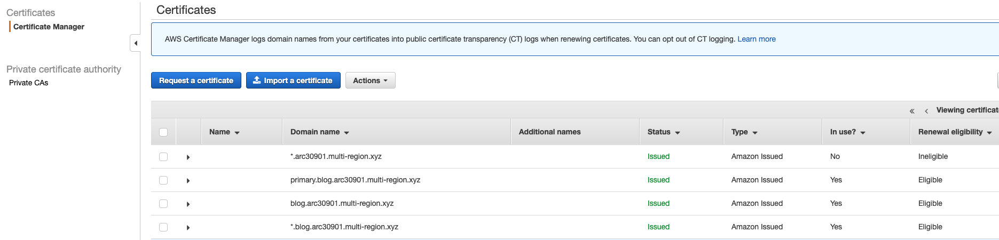 -->

## 1. Configure Custom Domains on each API Gateway in each region

<!-- Now that you have a domain name and a valid certificate for it, you can go
ahead and setup your APIs for each region to use your custom domain.  -->
API Gateway Custom domains allow you to access your API using your own domain
name. 
<!-- While you can configure DNS records to point directly to the regular API
Gateway endpoint, an error will be returned unless you have this custom domain
configuration. -->

New feature in Custom Domains names of Amazon API Gateway

AWS recently launched new feature in Custom Domains names of Amazon API Gateway. Customers can now create wildcard custom domain names for their Amazon API Gateway EDGE, Regional, and WebSocket APIs. This enhancement extends API Gateway’s existing support for invoking APIs via custom domain names backed by certificates from AWS Certificate Manager (ACM).

Creating an API Gateway wildcard custom domain name makes it easy to provide flexible API invoke URLs to customers, allowing for scalable customer isolation. For example, a common custom domain name use case is to implement customer-specific routing by providing each API customer with a unique, branded invoke URL. Previously this required creating a new API Gateway custom domain name for each customer, but now implementing this strategy will be possible with just one wildcard custom domain name.

You need one domain configurations in each Region with `*.` 

* `eu-west-1` Ireland:
    * `*.<subdomain>.multi-region.xyz`
* `ap-southeast-1` Singapore:
    * `*.<subdomain>.multi-region.xyz`

**High-level instructions**

Navigate over to the [`API Gateway`](https://eu-west-1.console.aws.amazon.com/apigateway/home?region=eu-west-1#/apis) in Ireland region, and create `Custom Domain Names`.
* Choose `REST` (if there is no "REST" option, choose "HTTP")
* Domain Name: `*.<subdomain>.multi-region.xyz`
* Choose `TLS 1.2`
* Choose `Regional` in the Endpoint Configuration
* Select ACM Certificate `*.<subdomain>.multi-region.xyz`

Save and edit. Then `Add mapping` to add the `Base Path Mappings` with `/` for path and `prod` for destination. 
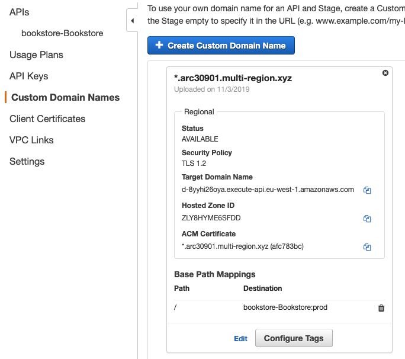

Now, _repeat_ the same process in **Singapore** region. 

You will use this Custom Domain in Ireland and Singapore to configure health checks and DNS records in Route 53. Copy the `Target Domain Name` from each region.

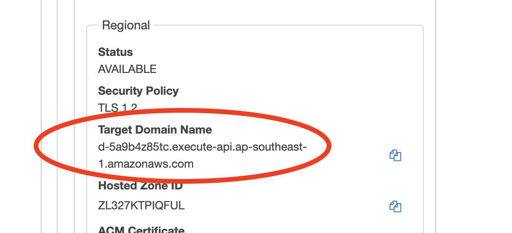

## 2. Configure Route53 DNS records

### 2.1 Configure DNS records for Health Check

We will create additional subdomain prefixes to configure health checks with `api-ir.` and `api-sg.`. (Please follow the naming.)

**High-level instructions**

Go to the `Route53` and select your `Hosted zones`. Choose your domain name from
the list and you should see a couple of records already configured for
nameservers.

Select `Create Record Set` with a new CNAME record `api-ir.` to point to Target Domain Name for your corresponding API Gateway Custom Domain. You can set the TTL to `1m (60 seconds)` for the
purpose of this workshop. We recommend setting ALL DNS entries to 1m (60 seconds)
as the TTL.
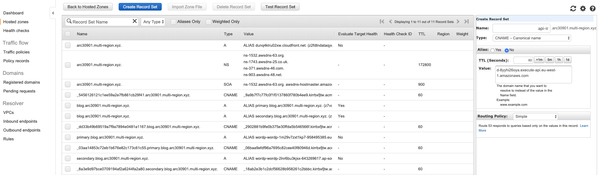

Create one more CNAME record with `api-sg.<subdomain>.multi-region.xyz` with `Target Domain Name` of `Custom Domain Name` in Singapore.
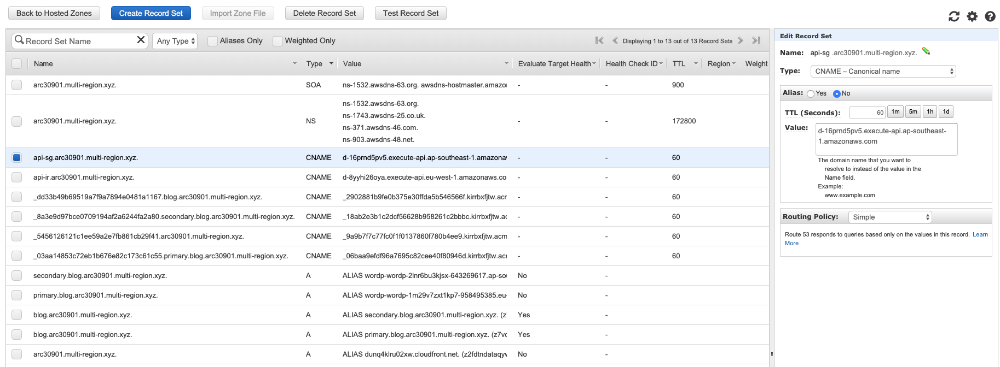

At this point you should now be able to visit your subdomain and see your API
working. Navigate to the health check endpoint on your API using your custom
domain in your web browser (e.g. `https://api-ir.<subdomain>.multi-region.xyz/books`) and
ensure that you see a successful response.

<!-- This endpoint should return the region it is running in so you can also
confirm that this response region matches up with the domain you have
configured. Notice how we're explicitly using HTTPS. It may take a few minutes for your records to
become active so check back later if you do not get a response. -->

### 2.2 Configure Health Check for both regions

In this step you will configure a Route53 health check on both
(Ireland and Singapore) regional endpoints. This health check will be responsible for
triggering a failover between the 2 regions if a problem is detected in the
one region.

<!--Note that if you were configuring an active-active model with something like
Weighted Routing then you would configure a health check on all endpoints, but
only one is necessary in this case since only our primary region will be
handling traffic under normal conditions.-->

**High-level instructions**

Select `Health checks` in Route53, and click `Create health check`.
* Name: identifiable name e.g. `ireland-api`
* What to monitor: `Endpoint`
* Specify endppoint by: `Domain Name`, Protocol: `HTTPS`, Domain name: `api-ir.<subdomain>.multi-region.xyz`, Path: `books`
* Advanced configuration: change `Request interval` to `Fast (10 seconds)` and set the failure threshold
from *3* down to *1*.  This will greatly speed up the time you need for testing
and failing over (this is not a recommended production configuration but it is
useful for speeding up the remainder of this Workshop).
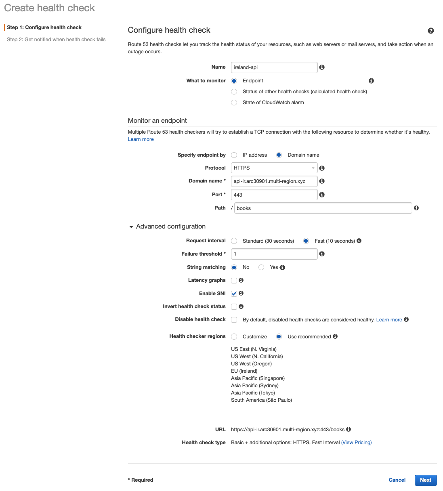

Skip the step to create an alarm. Now, do the same for the Singapore region API’s health check.
Once configured, wait a few minutes and you should see your health check go green and say Healthy in the console. Make sure this is green and healthy
before proceeding.
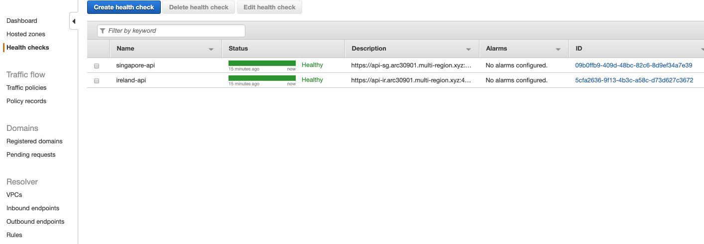

### 2.3 Configure DNS Routing Policy

Now let's configure the zone records for our `api.` subdomain prefix. You will
configure these as CNAME ALIAS records in a **Latency** routing policy using
your health check for Multi-region active-active backend. **Latency** routing policy routes traffic to the region that provides the best latency.

<!-- ***Note.*** To create records for complex routing configurations, you can also use the traffic flow 
visual editor and save the configuration as a traffic policy. However, we use the routing policy
for this workshop, as it is not possible to create an Alias record pointing to a DNS name that is 
being managed by a traffic policy. -->

**High-level instructions**

Choose `Hosted zones` in `Route53`. Select `Create Record Set` with a new CNAME record `api.` to point to each region API with Alias. Enter `api` as the name and choose
`CNAME` as the type. Now change Alias to `Yes` and select the `api-ir.` prefixed
version of your domain. Since this is an alias, it should appear in the
dropdown list.

Next, choose the `Latency` routing policy. Route 53 responds to queries based on the locations from which DNS queries originate. Remember to  create a `Default` location resource record set. 
Turn on both `Evaluate Target Health` and `Associate with Health Check` then select the `ireland-api` 
health check you created previously. 
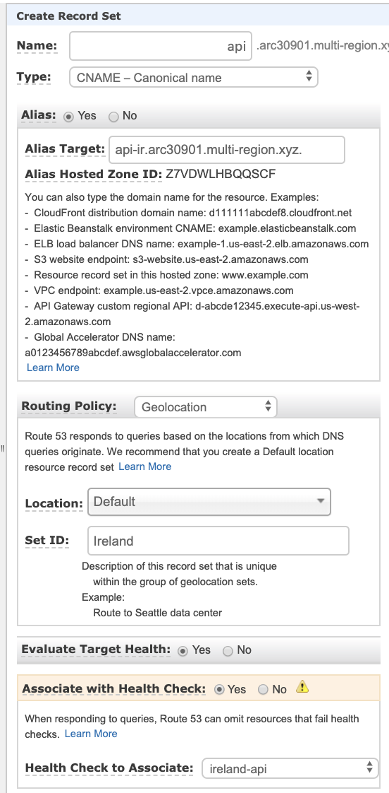

Create one more CNAME record with `api-sg` Alias with the same step. Choose the region with `ap-southeast-1`.

With the DNS configured, you should now be able to visit the `api.` prefix of
your domain (remember to use HTTPS). Go to the `/books` path and notice which 
regions is served based on Weighted routing policy.
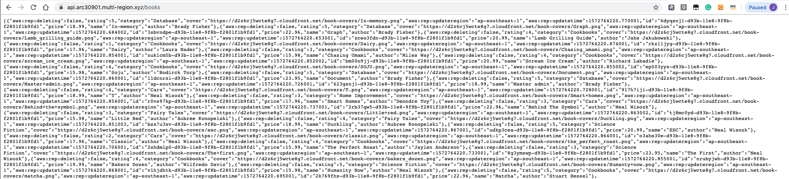

The last step is creating CloudFront alias in Route53. 

Copy your [CloudFront](https://console.aws.amazon.com/cloudfront) Domain Name (eg. dunq4klru02xw.cloudfront.net), and go to [Route53](https://console.aws.amazon.com/route53/home?#hosted-zones:). Select your Hosted Zones and `Create Record Set` for CloudFront CNAME. 
* Type: A-IPv4 address
* Alias: `Yes` and Target: `dunq4klru02xw.cloudfront.net`
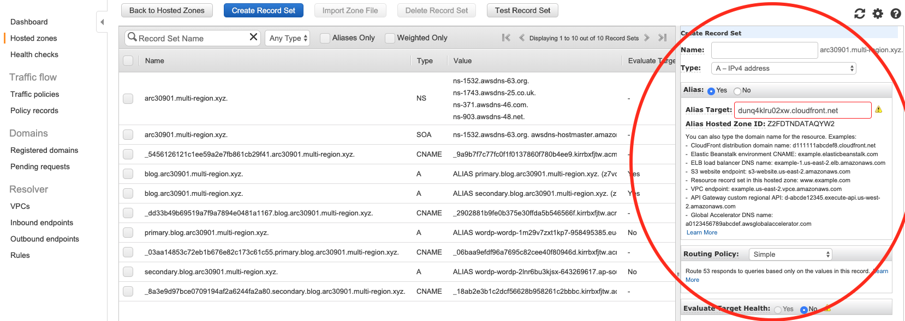

## 3. Update your UI with new API Gateway Endpoint

Now that we have active-active configuration, you will need to change the API
endpoint in your WebAssets to use our newly
created DNS name for our API endpoint.

Go to `CodeCommit`, select `Repositories`, and edit the *config.js* file (under *bookstore-WebAssets/src/config.js*) 
with `https://api.<subdomain>.multi-region.xyz` (substituting your own domain, make sure there is no trailing `/`) instead of the region specific name. Commit the changes and wait for Codepipeline/Codebuild to rebuild and update the S3 repository.

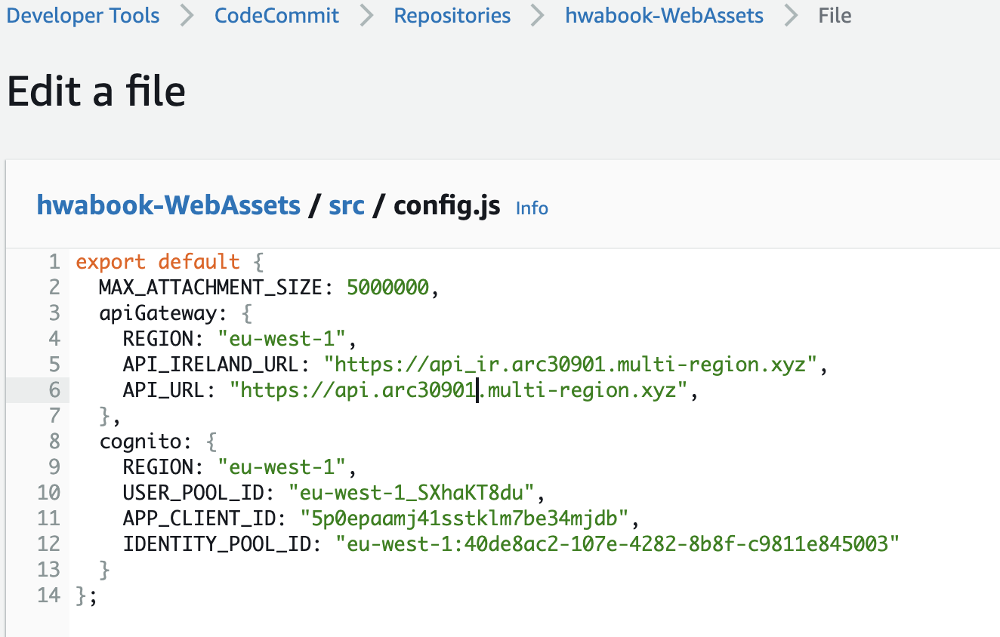

## Completion

Congratulations you have configured a multi-region API and set up a healthcheck-based Latency routing policy using Route53. 
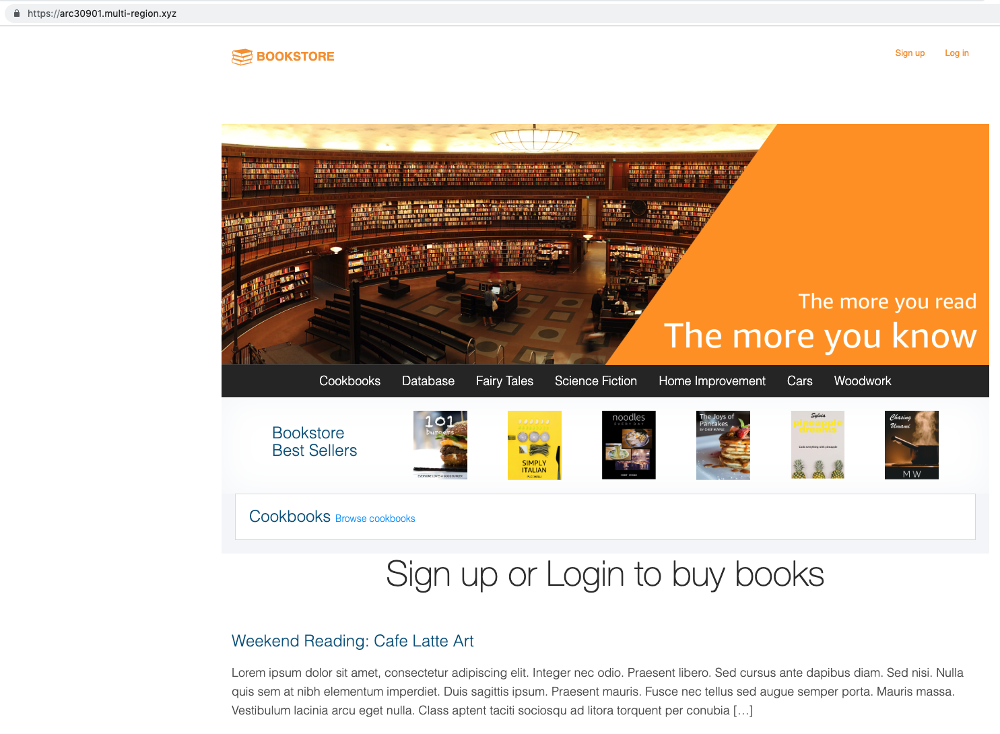

You can `Sign up` and `Log in` to order books through your domain `https://<subdomain>.multi-region.xyz/`. Order a book and see if `Order` and `Best Sellers` are working. Also, check the `Order` table in DynamoDB in `Ireland` region with the DynamoDB table in `Singapore` region to see whether your order data is replicated properly. 

***Note*** Sign up requires `Confirmation code` through your valid `Email address`.

In the next module we will intentionally break the primary region (Ireland) and verify that the second region (Singapore) works.

Module 4: [Test Multi-region Failover](../4_TestingFailover/README.md)
