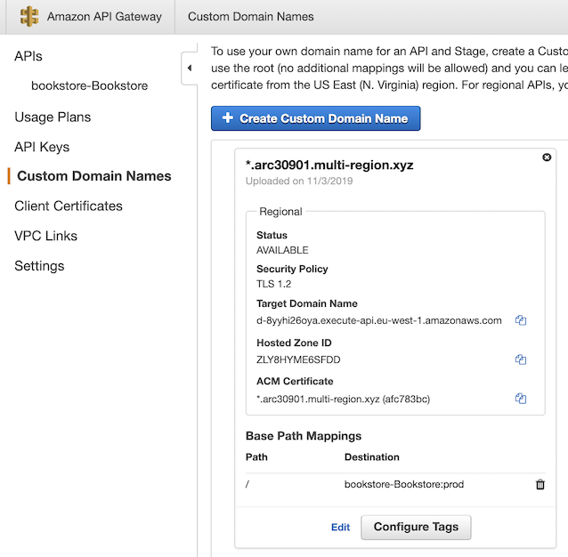
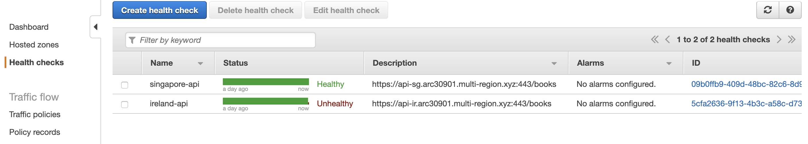

# Testing Multi-region Failover

To have real confidence in our multi-region active-active setup, we need to test it.
In this module we will artificially break our primary region and observe our failover in action.

To demonstrate this, we conduct a scenario where a developer
accidentally deletes the production setting in API gateway in
primary region (`Ireland`), thus breaking the API layer. We expect our application detects
this failure and adjusts the DNS settings to continue service of the
application from the second region (`Singapore`),
maintaining availability of the API/Database and functionality of the UI.

## 1. Breaking API layer in primary region (Ireland)

In the AWS Console, ensure you are in your primary region (`Ireland`) then head over to
`API Gateway` console, choose `Custom Domain Name`. Then delete the `Base Path Mappings` and save changes.

## 2. Verifying the failure

Now head over to `Route53` and select `Health checks`. Within a few
minutes, your health check should turn from Green to `Red` and display a
failure.

Since your DNS records are configured to use this health check, Route53 should
automatically use this information to point your application to the second region (Singapore).

You can validate this failover scenario when you visit `https://api-ir.<MYSUBDOMAIN>.multi-region.xyz/books` with `{"message":"Forbidden"}` error. However, you will get the book list when you visit `https://api.<MYSUBDOMAIN>.multi-region.xyz/books` as the Singapore region API is working properly (same as `https://api-sg.<MYSUBDOMAIN>.multi-region.xyz/books`. 

The web application UI should also continue to 
function and you should still be able to view and order books.

To confirm everything went as expected, go to your Bookstore application (`https://MYSUBDOMAIN>.multi-region.xyz/books`)
and order a book again. You should see your application indicates Singapore region. (**Singapore flag icon at top left hand corner**). In Singapore's DynamoDB console, you will also see that the `Orders` table has a new record.

Troubleshooting Common Issues

It is possible that your Operating system AND browser are caching the old DNS entries, hence your failover will have problem (eg: `403 error` in your browser as you purchase books.).  
To fix this:

* clear your dns entries in your OS, then verify how your OS is resolving your api endpoint, (eg: `host api.<MYSUBDOMAIN>.multi-region.xyz`). You can tell from the CNAME resolution which AWS region is being called.
* restart your browser or use another browser

 
<!-- `To verify your api endpoint has fail-overed, you can also use a tool, [CacheCheck](https://cachecheck.opendns.com/). 
Enter your api hostname (eg: `api.<your subdomain>.multi-region.xyz`) and observe how clients across the world are resovling your api endpoint. 
It should resolve to the api gateway in `ap-southeast-1` region.` -->

## Completion

Congratulations! You have now setup and verified an API that fails over from
one region to another automatically in the event of a disaster.

<!-- If you are feeling adventurous, you can read to the optional lab - [Global Accelerlator](../6_Optional/README.md). -->

Else to end the lab and prevent further AWS charges, please clean-up the AWS resources created in this workshop by following the [steps here.](../5_Cleanup/README.md)

<!-- The application you have built includes many components that you would need to
build your own Serverless applications in AWS including [AWS
Cognito](https://aws.amazon.com/cognito) for authentication, [AWS
Lambda](https://aws.amazon.com/lambda) for compute, [Amazon API
Gateway](https://aws.amazon.com/apigateway) for exposing an HTTP interface and
[DynamoDB](https://aws.amazon.com/dynamodb) for storing application data. A
good next step would be to start modifying this application to add your own
features and explore these services further. -->
