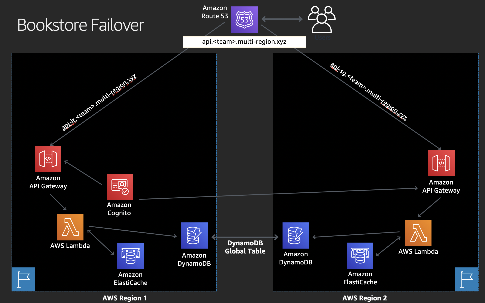
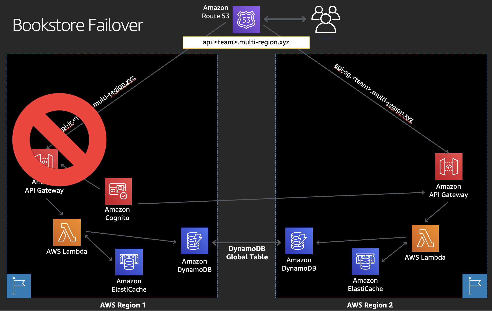

# Demo

We have prepared 2 environments that show how the bookstore works when both Regions are up and when Ireland Region API is down.

## Both  Ireland and Singapore are up

Access [Demo here](https://rivy.multi-region.xyz/). 

You can [sign up an account](https://rivy.multi-region.xyz/signup) if you want to explore the bookstore when both Regions are up.
Since we are in US, you will be routed to the Ireland region, as shown with the Ireland flag in the main web page.

## Ireland Region API is down, Singapore is up

Access [Demo here](https://rivy2.multi-region.xyz/).

You can [sign up an account](https://rivy2.multi-region.xyz/signup) if you want to explore the bookstore when Ireland Region is down.
You will be routed to the Singapore Region, as shown with the Singapore flag in the main web page.

