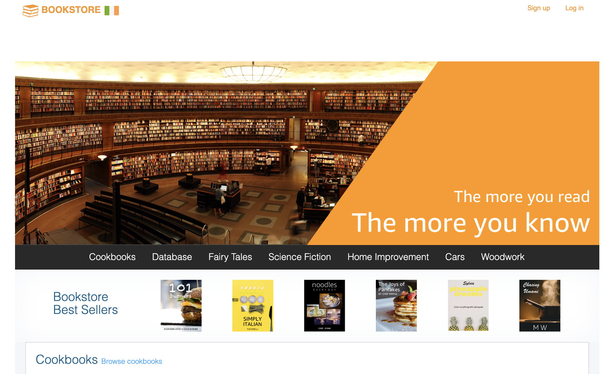
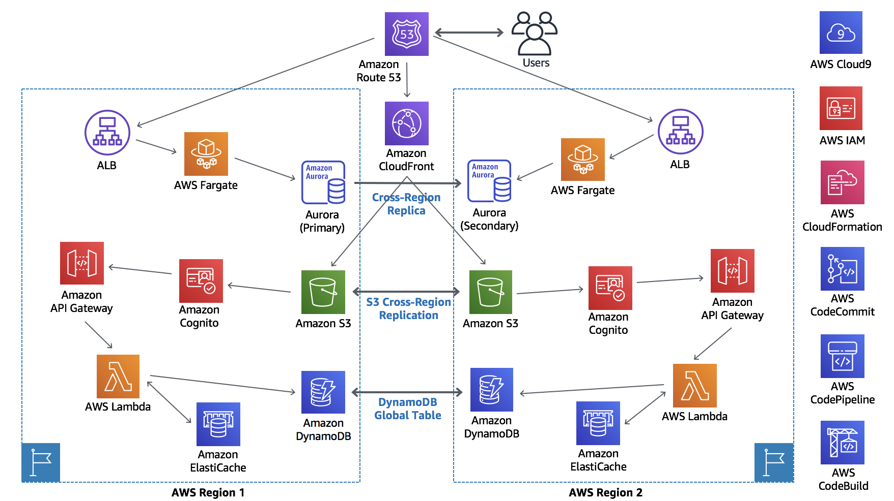

# How to build a multi-region highly available active-active architecture

This self-paced workshop takes to step by step **Building Multi-Region Active-Active (and Active-Passive) solution with morden architecture and polyglot persistent databases**. The web application is a Bookstore, and it can be used as a reference architecture for highly available ecommerce store.

Key points on implementation:

 * Multi-region Active – Active (Active – Passive) Architecture
 * Modern Web Application using Amplify and ReactJS
 * Modern Application architecture using Serverless and Container
 * Polyglot Persistence database architecture with DynamoDB and Aurora MySQL

<!-- Functionality
=============
 * The content marketing and blogging framework 
 * Ecommerce flow to purchase, manage the cart, checkout, order history and best seller products
 * It is a Cloud-Ready  -->

<!-- Highly Available
================
 * The application can failover to another region with RTO and RPO of less than 15 minutes
 * **RTO:** Recovery Time Objective – the targeted duration of time and a service level within which a business process must be restored after a disaster.
 * **RPO:** Recovery Point Objective –  the maximum targeted period in which data might be lost from a service due to a major incident. -->

Architecture Overview
=====================

The architeure includes the following flow:

1. An Wordpress layer for the book blog posts, using AWS Fargate and Aurora MySQL. (Module 1-1)
2. An UI layer built using HTML, Javascript (ReactJS) and CSS and hosted directly from AWS S3. An API layer built using Node.js running on AWS Lambda and exposed via Amazon API Gateway. A data layer storing book and order information in DynamoDB and Elasticache. (Module 1-2)
3. Build the same Wordpress layer in the secondary region. (Module 2-1)
4. Configure the replication across the regions for Aurora MySQL, S3, and DynamoDB. (Module 2-2)
5. Deploy the same UI and API layer in Singare. (Module 2-3)
6. Configure API gateway Custom Domain Name and Route53 Health Check for the failover testing. (Module 3)

For the purposes of this workshop, our failover is focused on the path from our application through API Gateway. 

<!-- The backend components are replicated to the second region so that it can be
failovered in the event of a disaster. All data in DynamoDB, S3, Aurora MySQL will be
replicated from the primary region to the secondary region ensures that our
application data will be available when we failover. -->

Application, Database, Infrastructure componets

**Application components**

* Web application blueprint – We include a React web application pre-integrated out-of-the-box with tools such as ReactJS Bootstrap, Redux, React Router, internationalization, and more.
* Serverless service backend – Amazon API Gateway powers the interface layer between the frontend and backend, and invokes serverless compute with AWS Lambda.  
* Authentication - Amazon Cognito to allow the application to authenticate users and authorize access to
the API layer. *Note* We will only use a single region for Amazon Cognito, as this serves as a reference implementation for authentication. In real-world deployment, this can be a social media authentication, eg: Amazon Cognito, Auth0, Facebook, Google etc.

**Database components**

* Product catalog/shopping cart - Amazon DynamoDB offers fast, predictable performance for the key-value lookups needed in the product catalog, as well as the shopping cart and order history. In this implementation, we have unique identifiers, titles, descriptions, quantities, locations, and price.
* Top sellers list - Amazon ElastiCache for Redis reads order information from Amazon DynamoDB Streams, creating a leaderboard of the “Top 20” purchased or rated books.
* Blog information - Amazon Aurora is a MySQL-compatible relational database that combines the performance and availability of traditional enterprise databases with the simplicity and cost-effectiveness of open source databases. In this implementation, it includes book information for Blog posts.

**Infrastructure components**

* Continuous deployment code pipeline – AWS CodePipeline and AWS CodeBuild help you build, test, and release your application code. 
* Serverless web application – Amazon CloudFront and Amazon S3 provide a globally-distributed application. 
* Health check and routing - AWS Route53 is used for DNS and allows us to perform
health checks on our primary region, and upon detecting an issue,
automatically switching to the secondary region using Route53 DNS updates.

Implementation Instructions
===========================

This workshop is broken up into multiple modules. In each, we will walk
through a high level overview of how to implement or test a part of this architecture. 

### Recorded Video walk-through of the labs

[Lab 1-1a](https://youtu.be/NezXEBoDYZY)

[Lab 1b-2](https://youtu.be/CzmhoHMXIsw)

[Lab 2](https://youtu.be/pbj3wHvWssc)

[Lab 3](https://youtu.be/aYCk7XOZ2wk)

<!-- You will expand sections for detailed command or console instructions. -->

**Region Selection**
We have designed this workshop to use Ireland as the Primary Region and Singapore as Secondary Region.
Please check before creating resources to ensure you are in the correct region:
* Primary Region : `eu-west-1` (Ireland)
* Secondary Region : `ap-southeast-1` (Singapore)

### Modules 
0. [Prepare prerequisites](0_Prerequisities/README.md)
1. [Build a bookstore on Primary region](1_PrimaryRegion/README.md)
2. [Build a bookstore on Secondary region](2_SecondaryRegion/README.md)
3. [Configure Routing](3_Route53Configuration/README.md)
4. [Test failover](4_TestingFailover/README.md)
5. [Cleaning Up](5_Cleanup/README.md)

**Important Note**

In order to conduct this workshop you need, 
1. your own **laptop** (not a tablet) with Chrome or Firefox browsers. You corporate laptop may have a problem accessing domain .xyz.
2. **an AWS Account** with access to use IAM, S3, DynamoDB, Lambda and API Gateway The instructions in this workshop assume **only one student is using a given AWS account at a time**. If you try sharing an account with another student, you'll run into naming conflicts for certain resources - we do not recommend this as there may be unpredictable results or difficult to identify configuration issues.
3. **AWS Account**: Also if you use the corporate account, you might have permission (IAM) or SCP problems. We need **Administrator access** for the workshop. Please create a new AWS account with IAM Administrator access. 
4. **VPC**: Also if your corporate account already has 5 VPCs in Ireland and Singapore, you might experience to hit the default **VPC limit of 5**. 
5. If your laptop's **security policy blocks any 3rd party cookies (required by Cloud9)**, pair up with someone else who has a laptop which is not blocked.

To start the workshop you need the AWS Command Line Interface(CLI). The front end application uses Amplify and requires nodejs and npm. To avoid spending time on configuring your laptop, we will use [AWS Cloud9](https://aws.amazon.com/cloud9/) as our IDE. It has AWS CLI preconfigured. Follow the instruction [here to launch a AWS Cloud9 IDE](0_Prerequisities/README.md) before you start the lab.
Cloud9 will be deployed in a VPC in Ireland. If you don't have any VPC (including **the default VPC**), please create a default VPC using the [VPC console in Ireland](https://eu-west-1.console.aws.amazon.com/vpc/home?region=eu-west-1#vpcs:sort=VpcId). 

### Let's start!
Start the lab: [Prepare prerequisites](0_Prerequisities/README.md)
